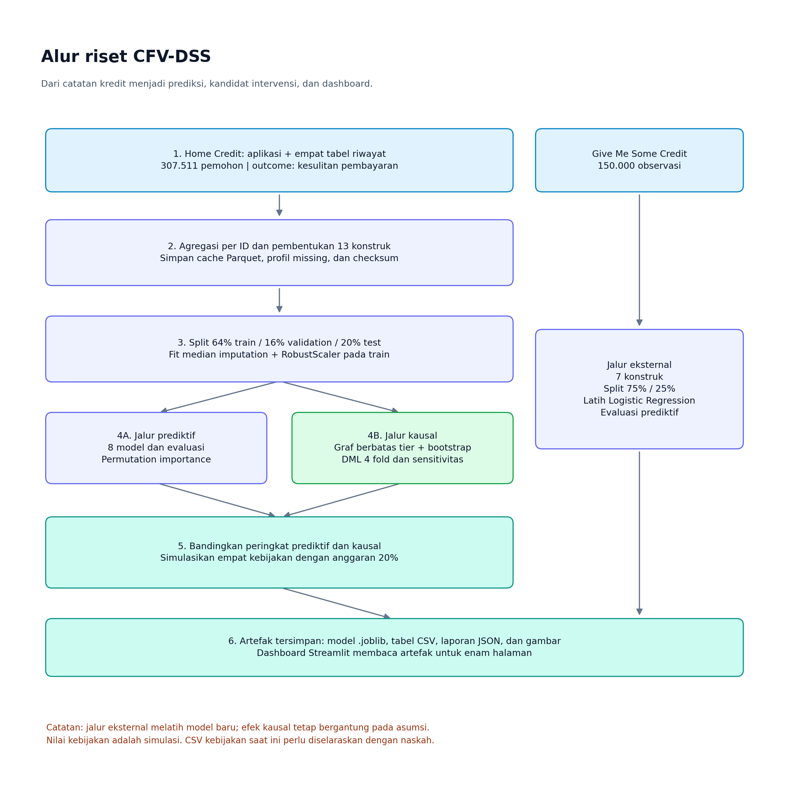
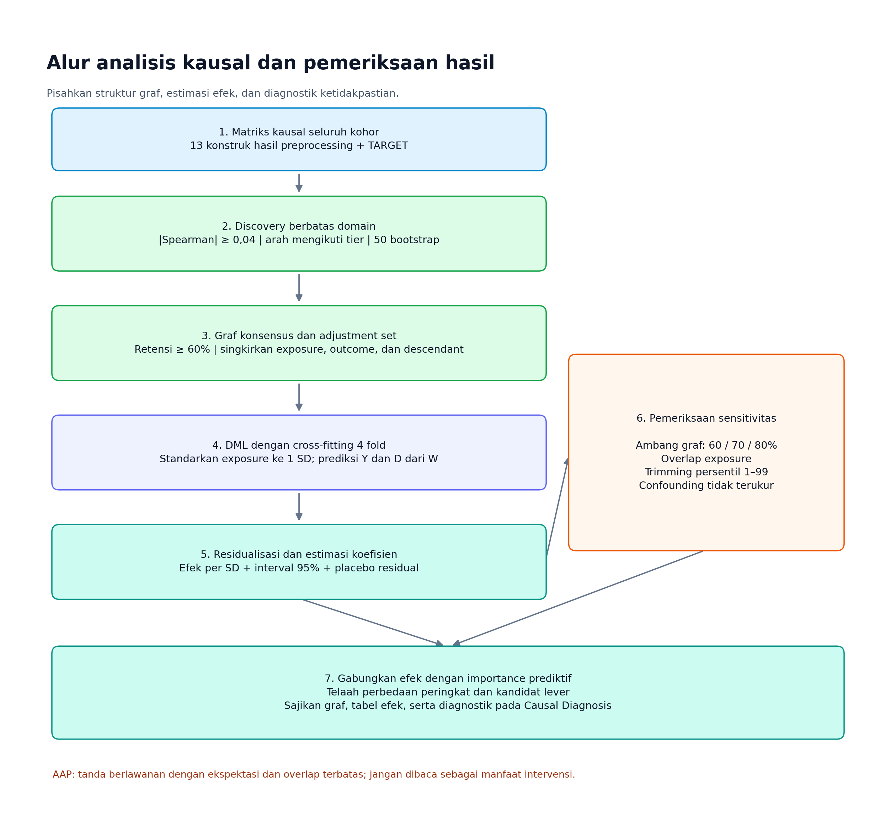
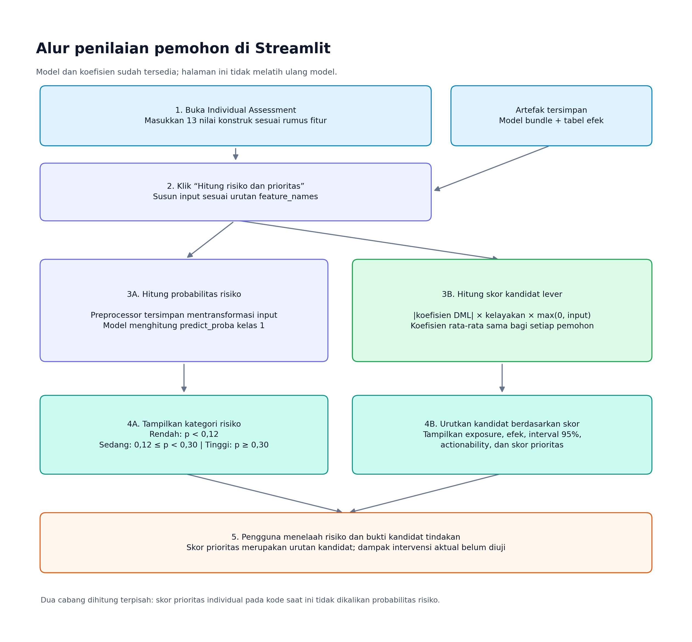

# Tahapan Teknis Riset CFV-DSS: dari Data Kredit hingga Dashboard Streamlit

Dokumen ini menjelaskan pelaksanaan riset **Causal Financial Vulnerability Decision Support (CFV-DSS)** berdasarkan kode dan artefak yang tersedia dalam proyek. Tujuannya membantu peneliti memahami asal data, pembentukan variabel, proses pemodelan, interpretasi hasil, dan penyajian hasil melalui Streamlit.

**Tanggal pemeriksaan:** 6 Oktober 2026. Angka hasil pada dokumen ini diambil dari artefak tersimpan, kecuali bagian yang secara eksplisit membandingkannya dengan naskah. Panduan ini mendokumentasikan implementasi saat ini; tidak menyatakan bahwa pelatihan atau aplikasi dijalankan ulang dalam penyusunan dokumen.

## 1. Tujuan dan pertanyaan riset

Riset bertujuan menghasilkan dukungan keputusan untuk kerentanan finansial yang berhubungan dengan kredit. Outcome yang diobservasi adalah kesulitan pembayaran, sehingga cakupannya tidak mewakili seluruh aspek kesejahteraan finansial rumah tangga.

Empat pertanyaan praktis mengarahkan alur analisis:

1. **Siapa yang berisiko?** Dijawab melalui model klasifikasi dan probabilitas kesulitan pembayaran.
2. **Apa yang membantu model memprediksi risiko?** Dijawab melalui permutation importance.
3. **Faktor mana yang menjadi kandidat intervensi?** Ditelaah melalui struktur berjenjang dan estimasi efek dengan asumsi kausal.
4. **Bagaimana sumber daya intervensi dialokasikan?** Dibandingkan melalui simulasi kebijakan dengan anggaran yang sama.

Prediksi risiko, penjelasan model, dan estimasi efek merupakan keluaran yang berbeda. Faktor penting bagi prediksi belum tentu dapat diubah atau menurunkan kesulitan pembayaran apabila diintervensi.

## 2. Gambaran alur penelitian



**Gambar alur 1.** Baca dari atas ke bawah. Data Home Credit bercabang menjadi analisis prediktif dan kausal, kemudian bertemu pada perbandingan prioritas dan simulasi kebijakan. Jalur Give Me Some Credit melatih model eksternal tersendiri. Seluruh hasil disimpan sebagai artefak sebelum dibaca dashboard.

Warna biru menunjukkan data, ungu menunjukkan pengolahan atau pemodelan, hijau menunjukkan analisis kausal, dan toska menunjukkan keluaran. Catatan berwarna jingga menjelaskan batas interpretasi.

Kerangka eksekusinya mengikuti CRISP-DM: pemahaman masalah, pemahaman data, persiapan data, pemodelan, evaluasi, dan penyajian aplikasi. Titik masuk pipeline utama adalah [`train.py`](train.py); uji sensitivitas dijalankan terpisah melalui [`sensitivity.py`](sensitivity.py).

## 3. Tahap pemanfaatan dan pemahaman data

### 3.1 Sumber data

Lokasi input diatur dalam [`config.py`](config.py) sebagai folder `Data Set Home Credit` pada direktori akar proyek.

| Berkas input | Peran dalam riset | Informasi yang dimanfaatkan |
|---|---|---|
| `application_train.csv` | Kohor utama Home Credit | ID pemohon, outcome, pendapatan, keluarga, jumlah kredit, annuitas, umur, dan masa kerja |
| `bureau.csv` | Riwayat kredit eksternal | Kredit aktif, jumlah kredit dan utang, keterlambatan, serta kedalaman riwayat |
| `previous_application.csv` | Riwayat aplikasi terdahulu | Jumlah pengajuan, persetujuan, penolakan, dan pengajuan dalam setahun terakhir |
| `installments_payments.csv` | Riwayat pembayaran angsuran | Pembayaran terlambat, kurang bayar, nominal tagihan, dan nominal pembayaran |
| `credit_card_balance.csv` | Riwayat kartu kredit | Saldo, limit, utilisasi, dan days past due |
| `cs-training.csv` | Kohor pembanding Give Me Some Credit | Utilisasi, rasio utang, pendapatan, tanggungan, umur, dan keterlambatan dua tahun |

Folder input juga berisi berkas lain seperti `application_test.csv`, `bureau_balance.csv`, dan `cs-test.csv`. Berkas tersebut **tidak dipakai oleh pipeline pelatihan yang didokumentasikan di sini**.

### 3.2 Unit analisis dan outcome

Pada Home Credit, satu observasi akhir mewakili satu aplikasi dengan ID `SK_ID_CURR`. Tabel aplikasi menjadi tabel induk, sedangkan riwayat dipadatkan menjadi statistik per ID sebelum digabungkan.

| Komponen | Home Credit | Give Me Some Credit |
|---|---:|---:|
| Jumlah observasi | 307.511 | 150.000 |
| Outcome asal | `TARGET` | `SeriousDlqin2yrs` |
| Makna nilai 1 | Kesulitan pembayaran pada kredit yang diajukan | Keterlambatan serius dalam dua tahun |
| Proporsi outcome positif | 8,07% | 6,684% |
| Jumlah konstruk | 13 | 7 |

Outcome positif Home Credit berjumlah 24.825. Proporsi yang kecil menyebabkan ketidakseimbangan kelas; akurasi saja tidak cukup untuk menilai model.

### 3.3 Pemeriksaan kualitas dan ketersediaan waktu

[`features.py`](features.py) menyimpan tipe data, jumlah missing, proporsi missing, jumlah nilai unik, dan duplikasi ID. SHA-256 setiap sumber dicatat untuk mengidentifikasi versi data yang digunakan.

Artefak [`leakage_audit.json`](artifacts/reports/leakage_audit.json) mencatat nol duplikasi ID, tidak adanya outcome dalam rumus konstruk, dan asumsi bahwa riwayat mendahului aplikasi. Namun, kode agregasi saat ini **belum menerapkan filter eksplisit tanggal indeks pada setiap tabel**. Sebagai contoh, tidak ada penyaringan `DAYS_CREDIT <= 0` atau pemeriksaan bersama tanggal tagihan dan pembayaran; kolom waktu kartu kredit juga tidak dibaca. Status temporal dalam JSON karena itu harus dipahami sebagai asumsi desain, bukan bukti bahwa setiap baris telah lolos pemeriksaan waktu otomatis.

Untuk data baru, urutan teknis yang diperlukan adalah menentukan tanggal keputusan, memeriksa waktu informasi tersedia, lalu hanya memasukkan informasi yang telah diketahui pada tanggal tersebut.

## 4. Tahap pengolahan dan agregasi riwayat

Implementasi agregasi tersedia dalam [`aggregate.py`](aggregate.py). CSV besar dibaca bertahap untuk mengurangi kebutuhan memori.

| Tabel | Ukuran chunk | Ringkasan per pemohon |
|---|---:|---|
| Bureau | 250.000 baris | Jumlah akun, akun aktif, utang dan kredit total, hari overdue, serta waktu kredit paling awal |
| Previous application | 250.000 baris | Jumlah aplikasi, persetujuan, penolakan, aplikasi baru, dan nominal aplikasi/kredit |
| Installments | 500.000 baris | Jumlah angsuran, keterlambatan, kurang bayar, hari keterlambatan, tagihan, dan pembayaran |
| Credit card | 500.000 baris | Jumlah catatan, saldo dan limit rata-rata, utilisasi rata-rata/maksimum, serta DPD maksimum |

Urutan prosesnya:

1. Membaca kolom yang diperlukan dari setiap chunk.
2. Membentuk indikator lokal, misalnya `is_late`, `is_underpaid`, atau utilisasi kartu.
3. Mengelompokkan chunk dengan `groupby("SK_ID_CURR")`.
4. Menggabungkan ringkasan chunk dan melakukan agregasi kedua.
5. Menggabungkan keempat ringkasan riwayat dengan outer join.
6. Menyimpan hasil dalam [`home_credit_historical_aggregates.parquet`](artifacts/data/home_credit_historical_aggregates.parquet).
7. Melakukan left join dari tabel aplikasi ke riwayat, sehingga pemohon tanpa riwayat tetap berada dalam kohor.

**Detail agregasi yang perlu diperhatikan:** jumlah, minimum, dan maksimum dapat digabungkan antarchunk secara langsung. Kode kartu kredit saat ini menggabungkan rata-rata chunk dengan rata-rata sederhana. Apabila jumlah catatan pemohon berbeda antarchunk, hasil tersebut belum tentu sama dengan rata-rata seluruh catatan. Reproduksi yang memerlukan rata-rata tepat harus memakai jumlah nilai dan jumlah observasi valid sebagai pembobot.

Cache Parquet mempercepat eksekusi berikutnya. Penggunaan cache juga berarti perubahan sumber data tidak otomatis membangun ulang konstruk; pembaruan data harus disertai pengelolaan cache yang disengaja.

## 5. Tahap pembentukan konstruk finansial

[`features.py`](features.py) mengubah ringkasan riwayat dan informasi aplikasi menjadi 13 variabel yang memiliki makna finansial. Rumus berikut merangkum implementasi aktual.

| Kode | Makna | Pembentukan dalam kode | Tier |
|---|---|---|---:|
| DBP | Tekanan beban pembayaran | `AMT_ANNUITY / income` | 3 |
| US | Tekanan utilisasi kartu | Rata-rata rasio `max(AMT_BALANCE, 0) / (AMT_CREDIT_LIMIT_ACTUAL + 1)`, dengan batas 0–5 | 3 |
| DS | Tingkat keterlambatan | `0,40 × late_rate + 0,25 × underpaid_rate + 0,20 × log1p(overdue_days) + 0,15 × log1p(max_DPD)` | 2 |
| HAIC | Kapasitas pendapatan per anggota keluarga | `income / family` | 1 |
| CE | Eksposur kredit | `log1p(bureau_active_count + prev_approved_count)` | 2 |
| RR | Keandalan pembayaran | `0,50 × clipped_paid_ratio + 0,25 × (1 − late_rate) + 0,25 × (1 − underpaid_rate)`; hasil dibatasi 0–1 | 2 |
| AAP | Tekanan keterjangkauan aplikasi | `AMT_CREDIT / income` | 4 |
| FHD | Kedalaman riwayat kredit | `−bureau_earliest_days / 365,25`, dengan batas bawah nol | 0 |
| HB | Beban rumah tangga | `(CNT_CHILDREN + 1) / family` | 0 |
| CNP | Tekanan pencarian kredit baru | `log1p(prev_app_1y_count + inquiries_month + inquiries_quarter + inquiries_year)` | 3 |
| EMPSTAB | Stabilitas pekerjaan | `−DAYS_EMPLOYED / 365,25` untuk nilai valid antara −36.500 dan 0 | 1 |
| AGE | Umur pemohon | `−DAYS_BIRTH / 365,25`, dibatasi 18–100 | 0 |
| DEBT_RATIO_BUREAU | Rasio utang kredit eksternal | `bureau_total_debt / (bureau_total_credit + 1)`, dibatasi 0–10 | 2 |

`income` dibatasi minimal 1. `family` dibatasi minimal 1; nilai keluarga yang kosong diganti dengan jumlah anak ditambah 1. Nama DEBT_RATIO_BUREAU perlu dibaca bersama rumusnya: penyebut aktual adalah jumlah kredit bureau, bukan total limit kartu.

Penanganan missing bersifat spesifik. Beberapa komponen DS dan CE diisi nol; komponen RR menggunakan default tertentu, termasuk paid ratio sebesar 1. Konstruk lain, seperti US atau FHD, masih dapat kosong dan akan diimputasi pada preprocessing. Karena itu, tidak semua ketiadaan riwayat diperlakukan identik.

Nilai tak hingga diubah menjadi `NaN`. Hasil akhirnya disimpan sebagai [`home_credit_constructs.parquet`](artifacts/data/home_credit_constructs.parquet), berisi ID, outcome, dan 13 konstruk. Kamus peran konstruk tersedia di [`construct_dictionary.csv`](artifacts/reports/construct_dictionary.csv).

Profil saat pemeriksaan menunjukkan missing US sebesar 71,74%, FHD dan rasio utang bureau sekitar 14,31%, serta EMPSTAB sekitar 18,01%. Angka ini perlu diperhatikan saat menilai dukungan data untuk rekomendasi individual.

## 6. Tahap pemisahan data dan preprocessing

[`train.py`](train.py) menggunakan seed 42 dan stratifikasi berdasarkan outcome. Pertama, 20% kohor dipisahkan untuk test. Kemudian, 20% dari sisa 80% dipisahkan untuk validation.

| Split | Proporsi dari kohor total | Jumlah observasi tersimpan | Fungsi |
|---|---:|---:|---|
| Train | 64% | 196.806 | Melatih preprocessing dan model |
| Validation | 16% | 49.202 | Mencoba kalibrasi probabilitas |
| Test | 20% | 61.503 | Mengukur performa dan menghitung importance |

Penugasan tiap ID disimpan dalam [`split_assignments.csv`](artifacts/data/split_assignments.csv).

Preprocessing dalam [`models.py`](models.py) terdiri atas `SimpleImputer(strategy="median")` dan `RobustScaler`. Keduanya di-fit pada train, kemudian digunakan untuk mentransformasi validation dan test tanpa fit ulang. ID pemohon tidak menjadi fitur prediksi.

RobustScaler menggunakan pusat median dan skala rentang interkuartil. Transformasi ini berbeda dari standardisasi satu simpangan baku yang dilakukan pada exposure di tahap DML. Implementasi saat ini juga tidak memiliki tahap winsorization berbasis kuantil setelah split, meskipun terdapat komentar kode yang menyebutkannya; clipping tertentu telah dilakukan saat pembentukan fitur.

## 7. Tahap pemodelan prediktif

Delapan algoritma dilatih pada fitur dan split yang sama:

| Model | Konfigurasi utama dalam kode |
|---|---|
| Logistic Regression | `max_iter=1000`, bobot kelas seimbang |
| Gaussian Naive Bayes | Parameter default |
| Decision Tree | Kedalaman maksimum 6, bobot kelas seimbang |
| Random Forest | 120 pohon, kedalaman maksimum 10, balanced subsample |
| Extra Trees | 120 pohon, kedalaman maksimum 10, bobot kelas seimbang |
| AdaBoost | 80 estimator |
| Histogram Gradient Boosting | 120 iterasi, bobot kelas seimbang |
| XGBoost | 120 pohon, kedalaman 5, learning rate 0,08, bobot positif dari prevalensi train |

Kode mencoba kalibrasi isotonic pada validation melalui `CalibratedClassifierCV`. Apabila percobaan tersebut memunculkan exception, kode memakai model asal. Keberadaan tahap percobaan kalibrasi karena itu tidak memastikan semua model akhir berhasil dikalibrasi.

Keluaran evaluasi meliputi ROC-AUC, average precision pada kolom `pr_auc`, Brier score, F1, recall, precision, dan confusion matrix. Label kelas untuk evaluasi dibentuk dengan threshold probabilitas 0,5.

**Pemilihan model aktual menggunakan ROC-AUC test tertinggi.** Brier score dilaporkan tetapi tidak menjadi syarat pemilihan dalam kode. Untuk evaluasi konfirmatori yang sepenuhnya memisahkan seleksi dan pengujian, seleksi model sebaiknya dipindahkan ke validation dan test dipakai sekali untuk hasil akhir.

### 7.1 Hasil model yang tersimpan

| Model | ROC-AUC | PR-AUC / AP | Brier | F1 |
|---|---:|---:|---:|---:|
| XGBoost | 0,6786 | 0,1657 | 0,2166 | 0,2173 |
| HistGradientBoosting | 0,6751 | 0,1629 | 0,2191 | 0,2132 |
| RandomForest | 0,6664 | 0,1545 | 0,2017 | 0,2189 |
| AdaBoost | 0,6635 | 0,1502 | 0,1201 | 0,0000 |
| LogisticRegression | 0,6541 | 0,1445 | 0,2301 | 0,2059 |
| ExtraTrees | 0,6532 | 0,1452 | 0,2304 | 0,2038 |
| GaussianNB | 0,6407 | 0,1310 | 0,1005 | 0,1546 |
| DecisionTree | 0,6355 | 0,1290 | 0,2325 | 0,1954 |

Sumber: [`model_comparison.csv`](artifacts/metrics/model_comparison.csv). XGBoost dipilih sebagai model referensi. Recall-nya 0,6032 dan precision-nya 0,1325 pada threshold 0,5. AdaBoost tidak memprediksi kelas positif pada threshold ini, sehingga Brier yang relatif rendah perlu dibaca bersama confusion matrix dan recall.

Kolom `calibration_slope` dan `calibration_intercept` saat ini berasal dari regresi linear outcome terhadap logit probabilitas melalui rumus kovarians. Keduanya belum merupakan hasil recalibration logistik standar.


Model individual, preprocessor, nama fitur, dan model terpilih disimpan sebagai berkas `.joblib`. Artefak utama aplikasi adalah [`best_model_bundle.joblib`](artifacts/models/best_model_bundle.joblib).

## 8. Tahap penjelasan prediksi

Permutation importance mengacak satu fitur pada data test, menghitung perubahan ROC-AUC, dan mengulangnya 10 kali. Hasil berupa rata-rata importance, simpangan antarulangan, dan peringkat prediktif.

Peringkat teratas saat pemeriksaan adalah RR, DEBT_RATIO_BUREAU, EMPSTAB, AGE, dan AAP. US berada pada peringkat 6, sedangkan CNP berada pada peringkat 9.

Maknanya adalah model memanfaatkan variabel tersebut untuk membedakan pemohon berisiko. Mengubah umur atau riwayat pembayaran lampau bukan tindakan yang dapat dilakukan sekarang. Importance juga tidak mengukur efek suatu intervensi terhadap outcome.


Sumber angka: [`predictive_importance.csv`](artifacts/metrics/predictive_importance.csv). Implementasi yang dijalankan memakai permutation importance. Label lama yang masih menyebut “SHAP” pada beberapa bagian kode atau CSV tidak menunjukkan adanya komputasi SHAP.

## 9. Tahap penemuan struktur kausal berbatas domain

Matriks [`causal_design_matrix.parquet`](artifacts/data/causal_design_matrix.parquet) dibentuk dengan mentransformasi **seluruh kohor** memakai preprocessor yang telah di-fit pada train, kemudian menambahkan outcome. Analisis discovery dan DML menggunakan matriks ini, bukan hanya subset train.

Tier dalam [`config.py`](config.py) membatasi arah hubungan:

| Tier | Peran | Konstruk |
|---:|---|---|
| 0 | Latar belakang | AGE, FHD, HB |
| 1 | Kapasitas | HAIC, EMPSTAB |
| 2 | Kondisi kredit historis | DS, CE, RR, DEBT_RATIO_BUREAU |
| 3 | Tekanan saat ini | DBP, US, CNP |
| 4 | Variabel keputusan aplikasi | AAP |
| 5 | Outcome | TARGET |

Tahapan dalam [`causal.py`](causal.py):

1. Menghitung korelasi Spearman absolut antarkonstruk.
2. Membentuk kandidat edge apabila ketergantungan mencapai ambang 0,04.
3. Mengarahkan edge dari tier lebih rendah ke tier lebih tinggi.
4. Untuk tier yang sama, memakai urutan kolom sebagai aturan arah.
5. Memeriksa graf dan menghapus edge apabila terdapat siklus.
6. Mengulang discovery pada 50 sampel bootstrap; setiap sampel maksimal 20.000 observasi.
7. Mempertahankan edge dengan frekuensi bootstrap minimal 60% sebagai graf konsensus.

Outcome berada di tier tertinggi sehingga tidak diarahkan ke variabel sebelumnya. Metode ini merupakan discovery berbasis ketergantungan dan aturan domain; bukan PC, FCI, atau NOTEARS, dan tidak menjalankan pengujian conditional independence. Frekuensi bootstrap mengukur pengulangan struktur dalam prosedur ini, bukan probabilitas bahwa edge terbukti kausal.


Keluaran: [`causal_discovery_stability.csv`](artifacts/causal/causal_discovery_stability.csv) dan [`consensus_graph.graphml`](artifacts/causal/consensus_graph.graphml).

## 10. Tahap estimasi efek dengan DML



**Gambar alur 2.** Graf menentukan kandidat variabel penyesuaian sebelum DML mengestimasi efek. Hasil estimasi kemudian diperiksa melalui sensitivitas graf, overlap, trimming, dan confounding, lalu dibandingkan dengan importance prediktif.

Enam exposure dianalisis: DBP, US, CE, AAP, CNP, dan DEBT_RATIO_BUREAU.

### 10.1 Penyusunan adjustment set

Untuk setiap exposure, kode memilih node graf yang bukan exposure, bukan outcome, bukan keturunan exposure, dan memiliki tier lebih rendah atau sama. Pemilihan ini menggunakan kandidat non-descendant secara luas; tidak dibatasi hanya pada parent. Jika exposure atau outcome tidak terdapat di graf, fungsi menggunakan fallback konstruk dengan tier lebih rendah. Jika adjustment set kosong, estimator memakai konstruk lain sebagai fallback.

Penyaringan tersebut membuat asumsi lebih terlihat, tetapi tidak dengan sendirinya membuktikan bahwa semua jalur confounding telah tertutup atau seluruh variabel yang dipilih aman dikondisikan.

### 10.2 Cross-fitting dan residualisasi

Exposure distandardisasi menjadi satuan simpangan baku. Data dibagi menjadi empat fold dengan seed 42. Pada setiap iterasi, nuisance model dilatih pada tiga fold dan memprediksi fold sisanya. Kode aktual memakai **HistGradientBoostingRegressor dengan 60 iterasi untuk outcome maupun exposure**.

Untuk outcome $Y$, exposure standar $D$, dan variabel penyesuaian $W$:

$$\widetilde{Y}_i = Y_i - \widehat{\mathbb{E}}[Y_i \mid W_i]$$

$$\widetilde{D}_i = D_i - \widehat{\mathbb{E}}[D_i \mid W_i]$$

$$\widehat{\theta} = \frac{\sum_i \widetilde{D}_i\widetilde{Y}_i}{\sum_i \widetilde{D}_i^2}$$

Estimator melaporkan koefisien per satu simpangan baku exposure, standard error, interval kepercayaan 95%, p-value, jumlah observasi, dan adjustment set. Uji placebo mengacak **residual exposure setelah cross-fitting**, lalu menghitung kembali asosiasi residual; seluruh nuisance model tidak dilatih ulang pada exposure yang diacak.

### 10.3 Hasil efek yang tersimpan

| Exposure | Koefisien per 1 SD | Interval kepercayaan 95% | Peringkat |
|---|---:|---|---:|
| US | 0,01648 | 0,01518–0,01777 | 1 |
| DEBT_RATIO_BUREAU | 0,01493 | 0,01360–0,01627 | 2 |
| CNP | 0,00852 | 0,00731–0,00973 | 3 |
| CE | 0,00711 | 0,00600–0,00822 | 4 |
| DBP | 0,00701 | 0,00595–0,00807 | 5 |
| AAP | −0,00632 | −0,00797 sampai −0,00466 | 6 |

Sumber: [`causal_effects_dml.csv`](artifacts/causal/causal_effects_dml.csv).

Koefisien US sebesar 0,01648 setara dengan kenaikan **1,648 poin persentase** probabilitas outcome per kenaikan satu SD setelah penyesuaian, di bawah asumsi estimator. Angka ini bukan kenaikan relatif 1,648% dan bukan dampak yang telah diamati dalam uji intervensi.

AAP memiliki tanda berlawanan dengan ekspektasi awal. Hasil ini harus dibaca bersama overlap dan sensitivitas; tidak menjadi bukti bahwa meningkatkan jumlah kredit yang diminta akan memperbaiki kondisi pemohon.

## 11. Tahap evaluasi sensitivitas

[`sensitivity.py`](sensitivity.py) membaca ulang matriks kausal dan artefak discovery agar tidak melakukan fit ulang preprocessing.

| Pemeriksaan | Prosedur | Hasil tersimpan |
|---|---|---|
| Ambang retensi graf | Mengulang graf dan DML pada 60%, 70%, dan 80% | 54, 51, dan 49 edge; rentang perubahan peringkat exposure = 0 |
| Overlap | Mengukur proporsi varians residual exposure dan variasi pada bin prediksi exposure | Lima exposure adequate; AAP limited |
| Trimming | Mempertahankan rentang persentil 1–99 prediksi exposure | 301.359 observasi; pergeseran absolut terbesar 0,00067 |
| Confounding tidak terukur | Menghitung robustness value dari statistik t dan derajat bebas | US paling kuat, RV 0,0440; AAP paling lemah, RV 0,0133 |

Proporsi varians residual US adalah 0,8624, sedangkan AAP hanya 0,3306 dan variasi pada bin terlemahnya 0,0210. Ambang adequate dalam kode adalah proporsi residual minimal 0,50 dan proporsi bin terlemah minimal 0,20; kategori limited memerlukan proporsi residual minimal 0,25 setelah syarat adequate tidak terpenuhi.

Diagnostik ini memeriksa dukungan variasi exposure yang diamati. Ia tidak merupakan pemeriksaan lengkap distribusi conditional treatment atau jaminan positivity untuk semua intervensi yang mungkin dilakukan. Robustness value juga merupakan diagnostik sensitivitas berbasis rumus residual/regresi; interpretasinya perlu mengikuti asumsi penerapannya pada DML.


Sumber: [`sensitivity_summary.json`](artifacts/reports/sensitivity_summary.json), [`overlap_diagnostics.csv`](artifacts/causal/overlap_diagnostics.csv), dan [`unobserved_confounding_sensitivity.csv`](artifacts/causal/unobserved_confounding_sensitivity.csv).

## 12. Tahap perbandingan prediksi dan relevansi intervensi

Peringkat permutation importance digabungkan dengan efek enam exposure. Korelasi Spearman dihitung pada exposure yang memiliki kedua peringkat, bukan pada seluruh 13 konstruk.

Artefak menunjukkan $\rho = 0,143$ dan $p = 0,7872$. US berada pada peringkat prediktif 6 tetapi peringkat kausal 1. CNP berada pada peringkat prediktif 9 tetapi peringkat kausal 3. RR paling penting secara prediktif, tetapi tidak masuk enam exposure intervensi.


Sumber: [`predictive_vs_causal_divergence.csv`](artifacts/causal/predictive_vs_causal_divergence.csv). Keluaran ini menjelaskan alasan sistem memisahkan audit model dari pemilihan kandidat tindakan.

## 13. Tahap simulasi kebijakan intervensi

Simulasi menggunakan subset test, probabilitas model terpilih, exposure pemohon, koefisien DML absolut, dan bobot kelayakan. Anggaran ditetapkan 20% dari subset test, yaitu `int(61.503 × 0,20) = 12.300` pemohon.

Rumus manfaat dalam implementasi:

$$b_{ij} = \max(0, x_{ij})\, |\widehat{\theta}_j|\, \widehat{p}_i$$

Untuk kebijakan berbobot kelayakan, manfaat dikalikan $\omega_j$. Bobotnya adalah US dan CNP = 1,0; AAP = 0,8; CE dan DEBT_RATIO_BUREAU = 0,6; DBP = 0,5. Exposure yang kosong diisi nol pada simulasi karena tidak ada kuantitas teramati untuk dikurangi.

| Kebijakan | Pemilihan pemohon dan lever dalam kode |
|---|---|
| A. Risk-Only | Memilih probabilitas tertinggi dan menerapkan satu lever dengan koefisien absolut terbesar |
| B. Predictive-Importance Only | Memakai satu exposure dengan peringkat prediktif tertinggi, lalu memilih pemohon berdasarkan manfaat simulasi lever tersebut |
| C. Causal Targeting | Memilih lever dengan manfaat terbesar untuk setiap pemohon, kemudian memilih pemohon dengan manfaat terbesar |
| D. Causal + Feasibility | Memilih lever dan pemohon berdasarkan manfaat yang telah dikalikan bobot kelayakan |

Terdapat dua detail yang memengaruhi interpretasi. Pertama, fungsi saat ini menggunakan **nilai konstruk mentah** $x_{ij}$ bersama koefisien per SD, sehingga belum menyetarakan exposure menjadi jumlah SD yang dapat dikurangi. Kedua, nilai absolut koefisien membuat AAP tetap dapat memperoleh skor meskipun tanda efeknya negatif. Skor tersebut perlu dianggap sebagai skenario komputasi, bukan estimasi manfaat intervensi yang telah teridentifikasi.

### 13.1 Perbedaan artefak dan naskah saat pemeriksaan

| Kebijakan | CSV yang dibaca Streamlit saat ini | Nilai yang dicantumkan naskah |
|---|---:|---:|
| A | 0,00 | 27,60 |
| B | 0,00 | 76,50 |
| C | 0,00 | 298,16 |
| D | 0,00 | 240,53 |

[`decision_policy_simulation.csv`](artifacts/causal/decision_policy_simulation.csv) saat ini berisi nol untuk keempat kebijakan. Ini merupakan perbedaan nyata dari [`article.md`](manuscript/article.md). Grafik [`policy_value.png`](artifacts/figures/policy_value.png) adalah berkas terpisah; kesesuaiannya dengan CSV harus diperiksa setelah regenerasi, bukan diasumsikan.

Kode [`tests/test_pipeline.py`](tests/test_pipeline.py) memiliki uji sintetis dengan seluruh exposure nol yang memanggil fungsi simulasi. Fungsi tersebut langsung menulis ke lokasi CSV hasil riset yang sama, sehingga **menjalankan uji ini dapat menimpa hasil kebijakan**. Mekanisme ini dapat menghasilkan pola nol yang terlihat sekarang; riwayat eksekusi penyebab pastinya belum diverifikasi.

Sebelum memakai hasil Policy Simulation untuk pelaporan, pisahkan lokasi keluaran uji dari keluaran riset, hitung ulang kebijakan dengan data test aktual, dan pastikan tabel, grafik, serta naskah konsisten. Penyusunan panduan ini tidak melakukan regenerasi atau perubahan hasil tersebut.


## 14. Tahap validasi prediktif eksternal

Give Me Some Credit diproses terpisah menjadi tujuh konstruk: US, DBP, HAIC, DS, CE, HB, dan AGE. Pemetaan mempertahankan kemiripan konsep, bukan kesamaan rumus atau definisi outcome dengan Home Credit.

Kohor eksternal dibagi 75% train dan 25% test, kemudian dilatih menggunakan pipeline median imputation, RobustScaler, dan Logistic Regression berbobot kelas seimbang.

Hasil tersimpan adalah ROC-AUC 0,7978, average precision 0,3344, dan Brier 0,1826. Sumber: [`external_validation.csv`](artifacts/metrics/external_validation.csv).

Proses ini melatih **model baru pada kohor eksternal**. Ia mengevaluasi kegunaan representasi konstruk di dataset lain, bukan menguji langsung model XGBoost Home Credit tanpa pelatihan ulang. Proses ini juga belum mengulang discovery dan DML pada kohor eksternal, sehingga belum memvalidasi transfer besar efek intervensi.

## 15. Tahap penyajian hasil melalui Streamlit

[`app.py`](app.py) membaca model bundle, tabel CSV, dan gambar yang telah dihasilkan pipeline. Aplikasi tidak melatih ulang delapan model atau mengestimasi ulang DML ketika halaman dibuka. `st.cache_resource` menyimpan model dalam cache aplikasi, sedangkan `st.cache_data` menyimpan tabel.

### 15.1 Pemetaan halaman dan keluaran

| Halaman | Data atau interaksi | Hasil yang ditampilkan |
|---|---|---|
| Overview | Model bundle dan tabel performa | Nama model, ROC-AUC, PR-AUC, Brier, empat fungsi DSS, dan peta prediktif-kausal |
| Individual Assessment | Input manual 13 konstruk | Probabilitas, kategori risiko, tabel prioritas kandidat, koefisien dan interval kepercayaan |
| Model Evaluation | Tabel delapan model dan importance | Metrik, grafik perbandingan model, serta peringkat importance |
| Causal Diagnosis | Graf, divergence, dan sensitivitas | Tiga tab: graf konsensus; efek dan divergence; sensitivitas dan overlap |
| Policy Simulation | CSV kebijakan dan grafik tersimpan | Empat kebijakan, coverage, utility, lever, dan gambar perbandingan |
| Governance | Profil data dan batas penggunaan | Interpretasi outcome, asumsi, pengawasan manusia, dan lokasi artefak |

Tab efek pada Causal Diagnosis memakai tabel divergence yang sudah memuat koefisien dan intervalnya. Hasil eksternal disimpan dalam artefak, tetapi **belum memiliki panel khusus dalam aplikasi saat ini**.

### 15.2 Alur penilaian satu pemohon



**Gambar alur 3.** Satu input pemohon menghasilkan dua cabang: probabilitas risiko dari model dan skor prioritas dari exposure, koefisien efek, serta kelayakan. Kedua keluaran ditampilkan bersama untuk ditelaah pengguna. Model tersimpan dipakai tanpa pelatihan ulang.

1. Pengguna membuka Individual Assessment.
2. Pengguna memasukkan nilai 13 konstruk sesuai rumus fitur. Input berupa nilai konstruk finansial, bukan z-score; aplikasi sendiri menjalankan preprocessing.
3. Kolom input diurutkan sesuai `feature_names` dalam bundle.
4. Preprocessor tersimpan mentransformasi input.
5. Model menghitung `predict_proba`, kemudian mengambil probabilitas kelas 1.
6. Aplikasi membentuk label **Rendah** untuk probabilitas < 0,12; **Sedang** untuk 0,12 sampai < 0,30; **Tinggi** untuk ≥ 0,30.
7. Tabel prioritas diurutkan berdasarkan skor exposure dan kelayakan.

Ambang kategori tersebut adalah aturan tampilan dalam kode. Ambang itu berbeda dari threshold 0,5 untuk evaluasi F1 dan confusion matrix, serta belum merupakan ambang keputusan yang dioptimalkan melalui analisis biaya.

Skor individual aktual adalah:

$$s_{ij} = |\widehat{\theta}_j|\, \omega_j\, \max(0,x_{ij})$$

Skor ini tidak dikalikan probabilitas individual. Ia juga menggunakan koefisien rata-rata yang sama untuk semua pemohon; variasi prioritas muncul dari exposure dan kelayakan, bukan dari estimasi conditional treatment effect per pemohon. Untuk US = 0,50, koefisien 0,01648, dan bobot 1,0, skor yang dihitung adalah 0,00824. Angka ini merupakan skor urutan kandidat, bukan janji penurunan risiko sebesar 0,824 poin persentase.

### 15.3 Ketergantungan aplikasi pada kelengkapan artefak

Walaupun halaman awal memeriksa keberadaan model bundle, `load_tables()` langsung membaca seluruh tabel, termasuk keluaran sensitivitas. Karena itu, menjalankan `train` saja belum cukup jika berkas sensitivitas belum ada. Jalankan `sensitivity` sebelum membuka aplikasi.

Apabila tabel atau model diganti saat aplikasi masih berjalan, restart aplikasi atau bersihkan cache Streamlit agar hasil yang tampil berasal dari artefak terbaru. Status aplikasi lokal pada saat ini tidak diuji dalam penyusunan panduan; pemetaan halaman di atas diperiksa dari kode.

## 16. Langkah menjalankan pipeline

Perintah berikut dijalankan di PowerShell dari direktori akar proyek, bukan dari dalam folder `cfv_dss`.

```powershell
Set-Location -LiteralPath 'D:\akas drive\FR_Dhanias\paper2'

# Buat environment apabila belum tersedia.
py -m venv .venv

# Pasang versi dependensi yang dicatat proyek.
.\.venv\Scripts\python.exe -m pip install -r .\cfv_dss\requirements.txt

# Bentuk fitur, latih model, analisis kausal, simulasi, dan validasi eksternal.
.\.venv\Scripts\python.exe -m cfv_dss.train

# Lengkapi artefak sensitivitas yang dibaca dashboard.
.\.venv\Scripts\python.exe -m cfv_dss.sensitivity

# Jalankan dashboard.
.\.venv\Scripts\python.exe -m streamlit run .\cfv_dss\app.py
```

Gunakan alamat lokal yang dicetak oleh proses Streamlit. Server harus tetap berjalan selama dashboard digunakan.

Versi Python yang tercatat dalam [`run_metadata.json`](artifacts/reports/run_metadata.json) adalah 3.14.0. Dependensi proyek meliputi pandas, NumPy, scikit-learn, SciPy, XGBoost, Streamlit, Matplotlib, NetworkX, PyArrow, dan joblib; versi pin dapat dibaca pada [`requirements.txt`](requirements.txt).

### 16.1 Penggunaan cache dan pembentukan ulang fitur

Jika hanya membuka dashboard dengan artefak lengkap, pelatihan ulang tidak diperlukan. Jika sumber Home Credit berubah, pembentukan ulang fitur dapat dipanggil secara eksplisit:

```powershell
.\.venv\Scripts\python.exe -c "from cfv_dss.features import build_home_credit_features; print(build_home_credit_features(force=True))"
```

Perintah ini menghitung dan menulis ulang cache Home Credit. Setelah itu, jalankan kembali `train` dan `sensitivity` agar model, tabel, dan gambar sesuai dengan fitur baru. `build_gmsc_features()` memiliki cache terpisah dan belum menerima parameter `force`; perubahan data GMSC memerlukan penanganan cache tersendiri.

### 16.2 Pemeriksaan kode

Proyek menyediakan perintah:

```powershell
.\.venv\Scripts\python.exe -m cfv_dss.tests.test_pipeline
```

Uji memeriksa batas tier, adjustment set, pemulihan efek sintetis, placebo, konsistensi tabel, dan sensitivitas. **Pada implementasi sekarang, salah satu uji menulis ulang CSV kebijakan dengan data sintetis.** Jangan menjalankannya setelah menghasilkan artefak final tanpa memisahkan keluaran uji atau memulihkan/menghitung ulang simulasi kebijakan. Kelulusan uji juga tidak membuktikan bahwa utility CSV masih berasal dari kohor riset.

## 17. Peta modul dan artefak

| Modul | Tanggung jawab |
|---|---|
| [`config.py`](config.py) | Path, seed, kamus konstruk, tier, exposure, dan kelayakan |
| [`aggregate.py`](aggregate.py) | Pembacaan chunk dan agregasi riwayat |
| [`features.py`](features.py) | Konstruk utama/eksternal, profil missing, dan checksum |
| [`models.py`](models.py) | Preprocessing, delapan model, evaluasi, dan importance |
| [`causal.py`](causal.py) | Discovery, adjustment set, DML, divergence, dan kebijakan |
| [`train.py`](train.py) | Orkestrasi pipeline, validasi eksternal, gambar, dan metadata |
| [`sensitivity.py`](sensitivity.py) | Ambang graf, overlap, trimming, dan robustness value |
| [`app.py`](app.py) | Input individual dan tampilan dashboard |

Struktur keluarannya:

```text
cfv_dss/
├── artifacts/
│   ├── data/       # Agregat, konstruk, split, dan matriks kausal
│   ├── models/     # Preprocessor, delapan model, bundle, model eksternal
│   ├── metrics/    # Performa prediksi, importance, validasi eksternal
│   ├── causal/     # Graf, efek, divergence, kebijakan, dan sensitivitas
│   ├── figures/    # Tujuh gambar riset
│   └── reports/    # Profil, kamus konstruk, audit, dan metadata
├── manuscript/
│   ├── article.md
│   └── article.docx
├── TAHAPAN_TEKNIS_RISET.md
└── app.py
```

## 18. Cara membaca hasil riset dan batas implementasi

Hasil prediktif tersimpan menunjukkan XGBoost memiliki diskriminasi tertinggi dalam perbandingan ini. Importance menonjolkan RR, sementara estimasi efek menempatkan US pada urutan pertama. Divergence tersebut mendukung pemisahan pertanyaan prediksi dari pertanyaan intervensi.

Untuk pelaporan hasil Streamlit, rujuk berkas yang benar-benar dimuat aplikasi, verifikasi kesesuaian gambar dengan CSV, dan jelaskan bahwa estimasi observasional masih bergantung pada asumsi. Lima exposure memiliki overlap yang dinilai adequate oleh diagnostik proyek, sedangkan AAP memiliki dukungan terbatas dan tanda yang berlawanan dengan ekspektasi.

Poin teknis yang masih perlu diselaraskan sebelum klaim hasil akhir diperluas adalah pemeriksaan temporal per baris, penggabungan rata-rata antarchunk, seleksi model melalui validation, pelaporan keberhasilan kalibrasi, penyetaraan exposure dalam simulasi, dan pemisahan keluaran uji dari artefak kebijakan. Catatan ini berasal dari kode dan perbedaan artefak yang ditemukan, bukan dari asumsi bahwa semua tahap tersebut sudah diselesaikan.

Dashboard merupakan prototipe dukungan keputusan. Keluaran saat ini dapat dipakai untuk mempelajari urutan risiko, audit faktor prediktif, dan menelaah kandidat mekanisme beserta ketidakpastiannya. Manfaat intervensi pada pemohon di dunia nyata memerlukan evaluasi prospektif tersendiri.
