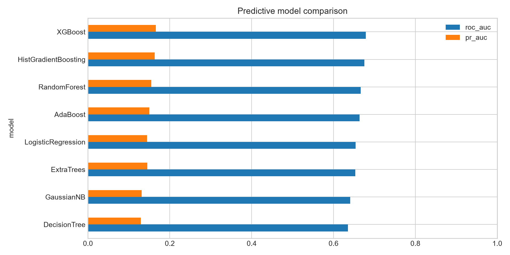
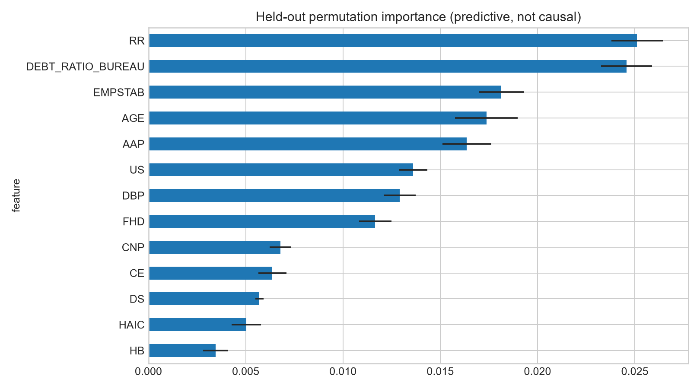
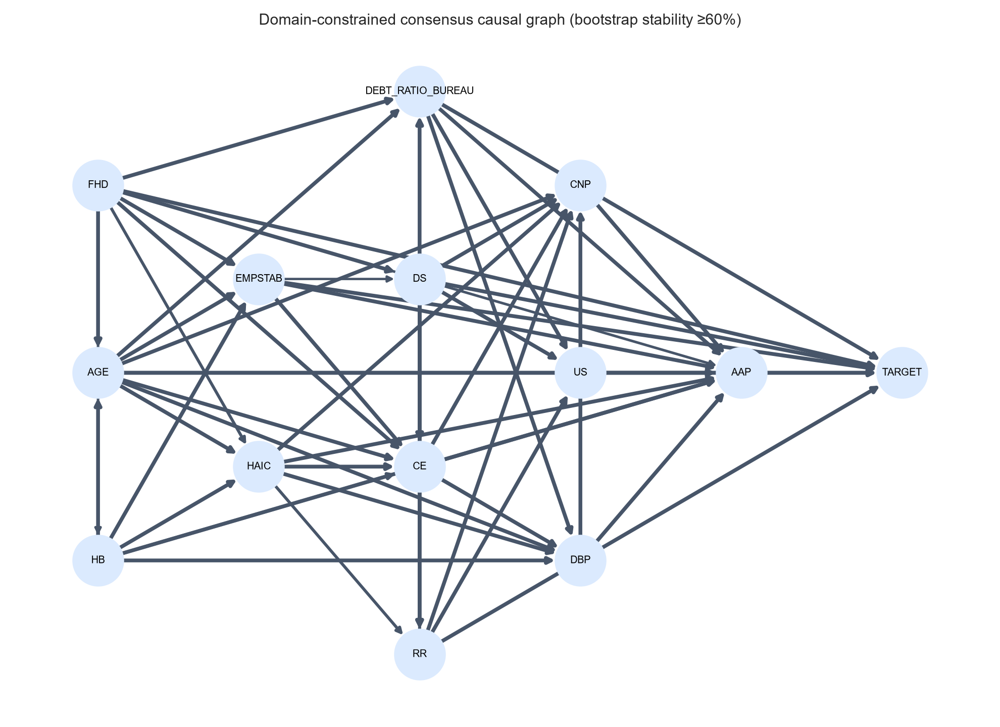
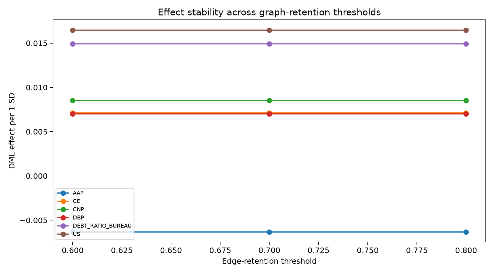
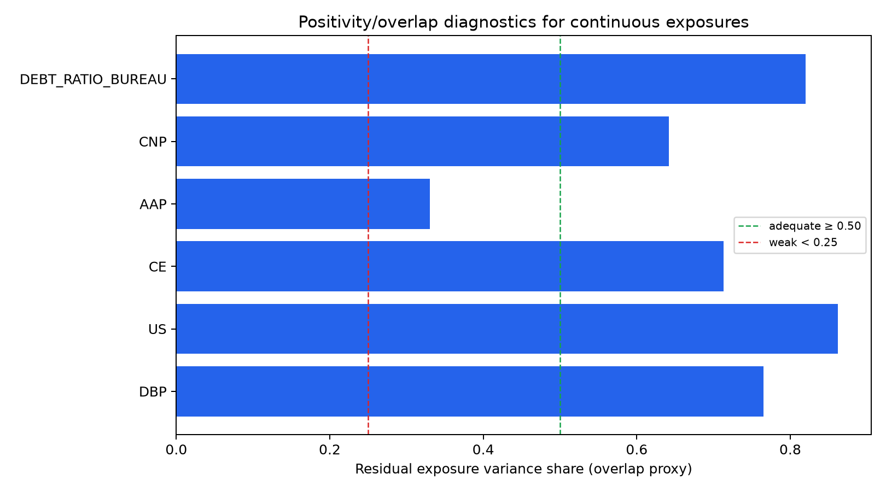
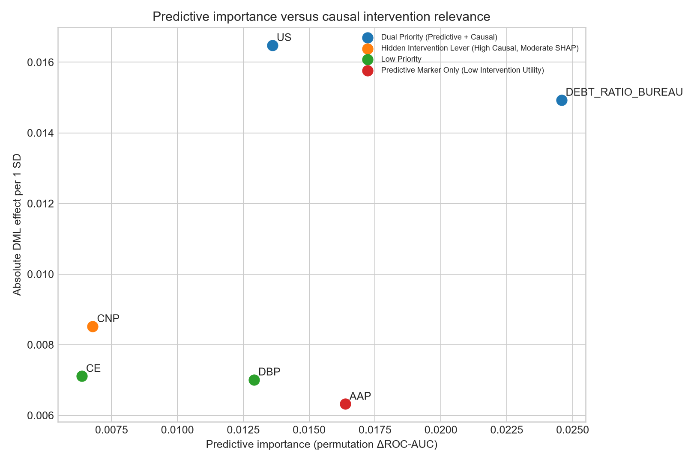
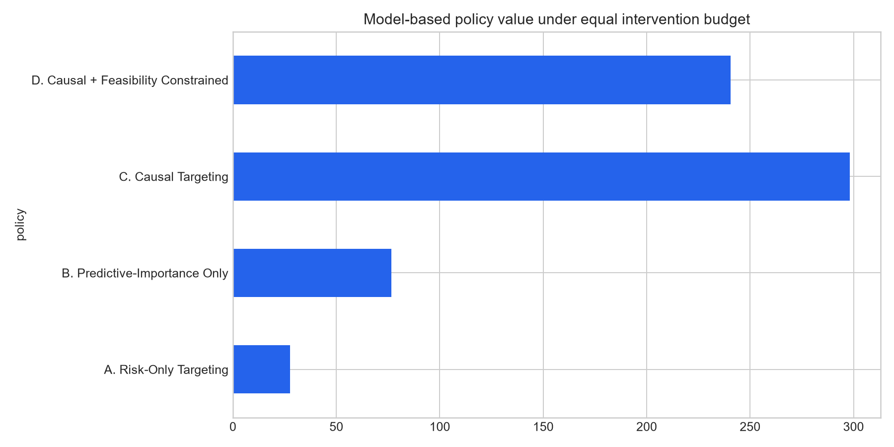

# From Risk Signals to Intervention Priorities: Domain-Constrained Causal Discovery and Causal Machine Learning for Financial Vulnerability Decision Support

## Abstract

Credit-risk prediction identifies borrowers likely to experience repayment difficulty but not intervention targets. Predictive explanations can rank proxies above modifiable mechanisms, motivating ineffective action. We develop a Causal Financial Vulnerability Decision Support (CFV-DSS) framework integrating leakage-safe features, prediction, constrained causal discovery, cross-fitted orthogonal estimation, sensitivity diagnostics, and policy simulation. Home Credit Default Risk provides the primary cohort (N = 307,511); Give Me Some Credit provides external robustness (N = 150,000). Among eight classifiers, XGBoost has the highest primary discrimination (ROC-AUC 0.679; PR-AUC 0.166), although calibration remains imperfect. Predictive and causal rankings diverge (Spearman ρ = 0.143, p = 0.787). Repayment reliability ranks first predictively but is not an intervention lever; utilization stress has the largest positive orthogonal effect (0.0165 probability points per standard deviation; 95% CI 0.0152–0.0178). Exposure ranks are unchanged across 60%, 70%, and 80% graph-retention thresholds. Five exposures have adequate overlap; application activity pressure has limited overlap and weakest confounding robustness. Under a 20% budget, causal targeting yields simulated utility 298.16, versus 76.50 for predictive-importance targeting and 27.60 for risk-only targeting. These quantities are not observed treatment effects. CFV-DSS separates vulnerability prediction, explanation, and intervention priority.

**Keywords:** decision support systems; financial vulnerability; causal discovery; causal machine learning; feature engineering; explainable AI; credit risk

## Highlights

- Domain features turn credit records into auditable vulnerability mechanisms.
- Constrained discovery separates candidate pathways from risk signals.
- Predictive importance differs from causal intervention relevance.
- Individualized causal targeting improves simulated decision utility.
- External validation tests transportability across consumer-credit datasets.

## 1. Introduction

A predictive model can identify borrowers likely to experience repayment distress yet recommend the wrong action. High risk answers who warrants attention; predictive explanations show which inputs drove the score. Neither identifies what to change to reduce vulnerability. This gap separates association-focused financial risk management from causal decision making (Montevechi et al., 2024; Ge et al., 2026; von Zahn et al., 2026).

Credit scoring and explainable AI are mature. Logistic baselines, ensemble trees, and gradient boosting provide discrimination; attribution methods make predictions inspectable; calibrated probabilities support thresholding (Davis et al., 2023; Abrahamsen et al., 2024). Yet feature attribution remains associational and cannot determine whether manipulating a ranked input changes the outcome (Feuerriegel et al., 2024; von Zahn et al., 2026). DSS novelty therefore requires evidence that analytics alter decisions and improve decision consequences.

Predictive importance and causal relevance answer distinct questions. Permutation importance measures performance loss when a feature mapping is disrupted, potentially prioritizing proxies, mediators, or colliders. Causal effects estimate outcome changes under interventions given assumptions about confounding, temporal precedence, overlap, and consistency (Feuerriegel et al., 2024; Sanchez et al., 2022). Predictive explanation remains essential for model audit, but intervention design requires dedicated causal evaluation.

Causal discovery bridges mechanisms and estimation, but unconstrained search over raw credit variables is neither semantically defensible nor temporally valid. Equivalent graphs can explain the same observational data, directions can violate index-date ordering, and post-decision variables leak labels. Domain tiers, bootstrap recurrence, and consensus graphs make assumptions auditable rather than proving causality (Ge et al., 2026; von Zahn et al., 2026).

We propose CFV-DSS, an end-to-end framework for credit-related financial vulnerability decision support. Home Credit Default Risk provides the primary cohort (N = 307,511); Give Me Some Credit provides external validation (N = 150,000). Five research questions guide the study: **RQ1**, discrimination and calibration across model classes; **RQ2**, dependency stability under constrained discovery; **RQ3**, actionable orthogonal effect estimates; **RQ4**, borrower-level priority variation; and **RQ5**, predictive-causal rank divergence and budgeted policy value.

Contributions comprise: (1) a compact, temporally audited feature space separating background, capacity, history, current pressure, decision, and outcome; (2) predictive-versus-causal divergence as a formal DSS diagnostic; (3) an orthogonal effect layer reporting adjustment sets, uncertainty, placebos, overlap, and unobserved-confounding bounds; and (4) budget-constrained policy simulation with external consumer-credit replication.

Recent consumer-credit studies extend this predictive agenda through interpretable scoring and graph-based representations of borrower information. These developments motivate comparing several learners while retaining a separate identification step for intervention claims (Chacon et al., 2026; Das et al., 2023).

## 2. Foundations and research problem

### 2.1 Credit-related financial vulnerability as a decision problem

Financial vulnerability encompasses limited shock absorption, inadequate savings, unstable income, and subjective stress. Public credit datasets observe only parts of this construct. We define **credit-related financial vulnerability** as elevated probability of repayment difficulty combined with observable mechanisms exerting pressure on repayment capacity.

Traditional scoring is lender-centric: estimate default probability, then apply approval or pricing rules. Vulnerability diagnosis asks which mechanism drives distress, whether it is feasible to alter, and with what uncertainty. Prescriptive financial analytics similarly distinguishes high predicted risk from heterogeneous benefit under a candidate action (Huh, 2026).

A viable DSS requires four outputs: calibrated risk (who needs attention), predictive explanation (what drives the model), causal diagnosis (which mechanisms are intervention candidates), and a decision layer (combining benefit, feasibility, and budget). This discovery–effect–policy decomposition follows the causal decision-making literature (Ge et al., 2026).

Financial well-being is a broader, multidimensional construct than repayment status. Recent conceptual and measurement reviews support making this distinction explicit: a credit label is an operational indicator of distress, whereas a comprehensive financial-health assessment requires additional subjective and objective measures (Garg et al., 2024; de Oliveira Cardoso et al., 2023).

Empirical research also examines household debt, financial vulnerability, stress, and well-being together. This literature provides substantive context for debt-pressure and capacity constructs without establishing that the same exposure effects apply to the two competition cohorts (Brzozowski & Visano, 2023; Martín-Legendre & Sánchez-Santos, 2024).

### 2.2 Predictive explanation versus causal explanation

Predictive explanation characterizes a fitted mapping; held-out permutation importance measures feature contributions to discrimination. These outputs explain model behavior but not counterfactual outcomes from policy changes (Davis et al., 2023; Feuerriegel et al., 2024).

Causal estimation evaluates distress-probability changes from standardized exposure reductions under an admissible adjustment set, assuming no unmeasured confounding, overlap, and consistency (Kennedy, 2023; von Zahn et al., 2026). Confounders inflate importance; colliders induce conditioning bias; proxies aid prediction without serving as intervention levers. Prediction and causal analysis therefore support different decision questions.

Credit-specific XAI frameworks and Shapley-based scorecards show how model outputs can become more transparent to borrowers and analysts. CFV-DSS uses this literature to motivate auditable explanations while requiring separate causal evidence before turning an explanation into advice (Nallakaruppan et al., 2024; Hlongwane et al., 2024).

### 2.3 Requirements for causal financial-vulnerability DSS

CFV-DSS satisfies six design requirements informed by causal DSS and human–AI workflow research (Sanchez et al., 2022; Westphal et al., 2023): **Financial meaning precedes search** (every construct has predefined source, role, expected direction, and actionability); **Temporal validity** (strict index-date precedence; outcome has zero outgoing edges); **Explicit uncertainty and diagnostics** (confidence intervals, placebos, overlap metrics, and Cinelli–Hazlett bounds); **Heterogeneity** (borrower-specific priorities); **Actionability** (immutable markers cannot become intervention levers); and **Decision evaluation** (budget-constrained policy utility, not ROC-AUC alone).

Fairness is a distinct design requirement alongside accuracy and explanation. Credit-scoring research studies both the implementation and profit implications of fairness constraints, while recent reviews assess performance, fairness, and explainability jointly; consequently, a transparent causal workflow still requires explicit subgroup evaluation (Kozodoi et al., 2022; Bahlool et al., 2026).

## 3. CFV-DSS framework

### 3.1 Domain feature layer

The feature layer converts raw records into 13 constructs. Debt Burden Pressure (DBP) is annuity divided by income. Utilization Stress (US) summarizes historical card balance relative to limits. Delinquency Severity (DS) combines late-payment rates, underpayments, bureau overdue days, and credit-card days past due. Household-Adjusted Income Capacity (HAIC) divides income by household size. Credit Exposure (CE) summarizes active bureau and approved prior-credit counts. Repayment Reliability (RR) combines paid-to-due ratio and absence of late or underpaid installments. Application Affordability Pressure (AAP) is requested credit relative to income. Financial History Depth (FHD) measures observed bureau years. Household Burden (HB) scales dependents to family size. Credit/New-Credit Pressure (CNP) combines recent prior applications and bureau inquiries. Employment Stability, age, and external debt-to-credit ratio complete the compact space.

### 3.2 Predictive layer

Eight model classes represent linear, probabilistic, tree, ensemble, and gradient-boosting alternatives: logistic regression, Gaussian naive Bayes, decision tree, random forest, extremely randomized trees, AdaBoost, histogram gradient boosting, and XGBoost. Preprocessing is fitted on training data only. Validation data calibrate probability outputs where supported. The untouched test split supplies ROC-AUC, PR-AUC, Brier score, F1, recall, precision, confusion matrix, and calibration diagnostics. The selected model becomes the predictive reference; importance remains explicitly non-causal.

Interpretable credit-decision alternatives include segmentation-based models and sparse additive interaction networks. These studies motivate considering model structure and decision usability alongside discrimination; they do not imply that interpretable predictive components identify causal levers (Idbenjra et al., 2024; Lan et al., 2025).

### 3.3 Causal structure layer

Constructs occupy six ordered tiers: background, capacity, historical credit condition, current pressure, current decision variables, and outcome. Edges may not point backward across tiers, and the outcome has no outgoing edges. Rank-based dependence scoring proposes candidate adjacencies; domain tiers orient admissible relationships. Fifty bootstrap samples assess recurrence. Edges retained in at least 60% of samples form the consensus graph. The threshold is exploratory and should be varied in confirmatory work.

Modern discovery surveys distinguish graph recovery, equivalence classes, and identification assumptions. This distinction is central to the tier-constrained design: domain-compatible orientations narrow the candidate graph space but do not resolve all observational ambiguities (Vowels et al., 2023; Zanga et al., 2022; Huber, 2024).

### 3.4 Causal effect layer

For each actionable exposure, the consensus graph supplies an adjustment set $W_j \subset X \setminus \{D_j, Y\}$ excluding descendants and outcome. Equations (1) and (2) define the partially linear outcome and exposure models:

$$Y = \theta_j D_j + g_j(W_j) + U, \quad \mathbb{E}[U \mid D_j, W_j] = 0 \tag{1}$$

$$D_j = m_j(W_j) + V_j, \quad \mathbb{E}[V_j \mid W_j] = 0 \tag{2}$$

Here $D_j$ is standardized exposure, $Y \in \{0, 1\}$ is repayment distress, $g_j(\cdot)$ and $m_j(\cdot)$ are nuisance functions estimated by 4-fold cross-fitting, and $\theta_j$ is probability-scale effect per exposure standard deviation. Equation (3) gives the Neyman-orthogonal estimator, adapting semiparametric residualization principles (Bach et al., 2024; Knaus, 2022):

$$\hat{\theta}_j = \frac{\frac{1}{N} \sum_{i=1}^N (D_{ij} - \hat{m}_j(W_{ij})) (Y_i - \hat{g}_j(W_{ij}))}{\frac{1}{N} \sum_{i=1}^N (D_{ij} - \hat{m}_j(W_{ij}))^2} = \frac{\widehat{\mathrm{Cov}}(\tilde{D}_j, \tilde{Y})}{\widehat{\mathrm{Var}}(\tilde{D}_j)} \tag{3}$$

Asymptotic standard errors $\hat{\sigma}_j$ derive from empirical score variance, yielding symmetric 95% confidence intervals $[\hat{\theta}_j - 1.96\hat{\sigma}_j, \hat{\theta}_j + 1.96\hat{\sigma}_j]$. Cross-fitting controls bias from flexible nuisance learners (Bach et al., 2024; Kennedy, 2023). A permuted-exposure placebo model $\hat{\theta}_j^{\mathrm{placebo}}$ evaluates whether the residualization pipeline introduces mechanical confounding.

### 3.5 Decision layer

Policy simulation evaluates capital and counseling allocation under resource cap $B = 0.20 \cdot N$. Equation (4) computes borrower-lever utility:

$$u_{ij} = \max(0, D_{ij}) \cdot |\hat{\theta}_j| \cdot \hat{p}_i \cdot \omega_j \tag{4}$$

Here $\max(0, D_{ij})$ is reducible exposure, $|\hat{\theta}_j|$ is causal sensitivity, $\hat{p}_i$ is baseline risk, and $\omega_j \in (0, 1]$ discounts implementation friction. Under action $a_i$ and $\sum_i \mathbb{I}(a_i > 0) \le B$, Equation (5) aggregates policy utility:

$$U(\pi) = \sum_{i=1}^N \sum_{j=1}^J \mathbb{I}(a_i = j) \cdot u_{ij} \tag{5}$$

Four canonical digital financial management policies are evaluated:
1. **Policy A (Risk-Only Priority):** Selects top $20\%$ borrowers with highest $\hat{p}_i$; assigns uniform population-best causal lever $j^* = \arg\max_j \hat{\theta}_j$.
2. **Policy B (Predictive-Importance Priority):** Selects top $20\%$ borrowers and assigns the lever possessing the highest global permutation importance among candidate exposures.
3. **Policy C (Individualized Causal Priority):** Jointly assigns borrower-lever pairs maximizing individualized unweighted benefit $a_i = \arg\max_j (\max(0, D_{ij}) \cdot |\hat{\theta}_j| \cdot \hat{p}_i)$ with $\omega_j = 1$.
4. **Policy D (Causal-Plus-Feasibility Priority):** Allocates resources according to full managerial utility $u_{ij}$ incorporating actionability weights $\omega_j$.

The allocation problem is related to offline multi-action policy learning, which explicitly considers feasible policy classes and budget constraints, and to recent analysis of estimation failures in observational multi-action settings. Here, the utility function remains a transparent scenario score rather than an identified off-policy value estimator (Zhou et al., 2023; Cerulli, 2026).

## 4. Data and methods

### 4.1 Datasets and index-date design

Home Credit Default Risk is the primary cohort. The unit of analysis is one current application identified by `SK_ID_CURR`. `application_train.csv` supplies index-time attributes and `TARGET`, where one denotes repayment difficulty on the current loan. Historical sources include `bureau.csv`, `previous_application.csv`, `installments_payments.csv`, and `credit_card_balance.csv`. Aggregations include only records defined as preceding the index application by dataset construction. No current-loan post-index installment fields enter the construct space.

The final primary cohort contains 307,511 applicants and 24,825 positive outcomes, a prevalence of 8.07%. Give Me Some Credit contains 150,000 records and a 6.68% rate of serious delinquency within two years. It supports an external reduced construct map: utilization, debt burden, household-adjusted income, delinquency severity, credit exposure, household burden, and age. Formulas preserve conceptual equivalence rather than false identity across datasets.

The index date requires explicit treatment because it determines which information the decision maker could legitimately observe. In Home Credit, all day-denominated fields are expressed relative to the current application, with negative values indicating prior events. This convention permits a direct temporal rule: a historical record qualifies only when its day offset is non-positive. Bureau records carry `DAYS_CREDIT`, previous applications carry `DAYS_DECISION`, and installment records carry `DAYS_INSTALMENT` and `DAYS_ENTRY_PAYMENT`. Each aggregation therefore summarizes a window that closes at the index application rather than extending beyond it. The outcome horizon follows the competition definition: payment difficulty on the current loan, observed after the index decision. This separation is the paper's central temporal guarantee, because the engineered mechanisms describe the applicant's state at the moment a decision would be made, while the label describes what happened subsequently.

Inclusion criteria are deliberately permissive to avoid constructing an artificially clean cohort. All training-set applications are retained, including applicants with no bureau history, no previous application, no installment record, and no credit-card record. Excluding such applicants would improve apparent data quality while silently removing the thin-file population that vulnerability analysis most needs to serve. Instead, absent history is modeled as structurally missing rather than as zero in the predictive layer, because an applicant with no observed revolving-card record is epistemically different from an applicant with a recorded utilization of zero. Give Me Some Credit receives no row deletion either; its missing income and dependent fields pass through the same imputation discipline. Neither dataset is redistributed, and both remain subject to their original competition terms.

### 4.2 Leakage-safe preprocessing

A fixed seed of 42 supports reproducibility. Stratified splitting reserves 20% as test data. The remaining 80% is separated into training and validation sets. Median imputation and robust scaling fit on training data only. Historical tables are processed in chunks because their combined size exceeds 2 GB; per-applicant sufficient statistics are persisted to Parquet before merging. Checksums record source versions. Applicant identifiers do not enter any model.

Missing historical records have construct-specific meaning. Modeling imputation uses training medians to avoid creating artificial extremes. Policy simulation treats absent exposure history as zero reducible exposure—for example, no observed revolving-card history implies no observed utilization quantity to reduce—while retaining uncertainty caveats. Infinite ratios are converted to missing before preprocessing. The leakage audit confirms no duplicate application identifiers and no mathematical embedding of the outcome in engineered constructs.

Aggregation is performed out of core so the complete histories can be processed on ordinary workstation hardware without sampling. Bureau records provide account count, active-account count, credit and debt totals, overdue days, prolongation count, and earliest observation. Previous applications provide application, approval, refusal, recent-application, and requested-credit summaries. Installment histories provide paid-to-due ratio, late-payment rate, underpayment rate, total days late, and unpaid amount. Credit-card histories provide mean and maximum utilization, balance, credit limit, and days past due. Chunk-level applicant summaries are aggregated a second time after concatenation, ensuring that results are identical to a single in-memory group operation for additive, minimum, and maximum statistics. The merged historical table is cached as Parquet, which separates expensive data preparation from subsequent experimental reruns.

Three controls address reproducibility. First, source SHA-256 checksums freeze the exact input versions used for the reported results. Second, `split_assignments.csv` records every application's train, validation, or test assignment, preventing silent resampling across analyses. Third, the fitted imputer, scaler, eight estimators, selected-model bundle, construct table, and standardized causal design matrix are persisted. These artifacts permit the dashboard and sensitivity analyses to reuse the exact transformation learned during model development rather than fitting preprocessing again on production or full-cohort input. The same rule prevents external validation from influencing primary-model selection.

The separation of historical aggregation, training-only preprocessing, and untouched evaluation follows recent work identifying leakage as a major source of overoptimistic scientific claims. Temporal restrictions therefore apply to information availability as well as to train–test separation (Kapoor & Narayanan, 2023).

### 4.3 Domain-informed feature engineering

Table 1 details the 13 financial vulnerability constructs, their operational definitions, assigned temporal tiers, and actionability categories.

**Table 1. Operational definitions and actionability tiers for engineered constructs.**
| Code | Construct | Operationalization | Tier | Actionability |
|---|---|---|---:|---|
| DBP | Debt Burden Pressure | annuity / income | 3 | partial |
| US | Utilization Stress | historical card balance / limit | 3 | high |
| DS | Delinquency Severity | weighted late, underpaid, overdue, DPD history | 2 | limited short-term |
| HAIC | Household-Adjusted Income Capacity | income / family size | 1 | partial |
| CE | Credit Exposure | log active bureau + approved prior credits | 2 | planning horizon |
| RR | Repayment Reliability | paid-to-due and on-time composite | 2 | limited immediate |
| AAP | Application Affordability Pressure | requested credit / income | 4 | origination |
| FHD | Financial History Depth | years since earliest bureau record | 0 | none |
| HB | Household Burden | dependents relative to family size | 0 | low |
| CNP | Credit/New-Credit Pressure | recent applications + inquiries | 3 | high |
| EMPSTAB | Employment Stability | valid employment duration in years | 1 | low |
| AGE | Applicant Age | age at application | 0 | none |
| DEBT_RATIO_BUREAU | External Debt-to-Limit Ratio | bureau debt / bureau credit | 2 | planning horizon |

Expected distress directions were positive for DBP, US, DS, CE, AAP, HB, CNP, and external debt ratio; negative for HAIC, RR, FHD, employment stability, and age. Sign disagreement triggers interpretation review rather than post-hoc feature redefinition.

### 4.4 Predictive baselines and calibration

All models use the same construct set and split. Class weighting addresses imbalance where supported. Tree depths and ensemble sizes are bounded to reduce overfitting and runtime (Montevechi et al., 2024). XGBoost uses 120 trees, depth five, learning rate 0.08, and a training-prevalence scale weight. Calibration uses the validation fold when estimator support permits. The comparison represents diverse supervised learners rather than an exhaustive hyperparameter tournament, focusing on decision support rather than leaderboard competition (Shi et al., 2022; Noriega et al., 2023).

Recent credit-risk reviews motivate this comparison across algorithm families and emphasize that performance depends on data preparation, evaluation design, and interpretability. The compact construct comparison should therefore be read as an application-specific benchmark (Shi et al., 2022; Noriega et al., 2023).

### 4.5 Predictive explanation

Held-out permutation importance repeats ten shuffles per feature and measures change in ROC-AUC. Means and standard deviations report rank stability. This substitutes for SHAP because the executable environment targets Python 3.14, while preserving the central inferential boundary: feature perturbation describes predictive dependence, not intervention effect. The dashboard labels predictive outputs accordingly.

Class imbalance can also destabilize local credit-scoring explanations. Reporting repeated held-out perturbations addresses empirical variability in the chosen importance measure, although it does not establish the stability of other explanation methods or confer causal meaning (Chen et al., 2024).

### 4.6 Domain-constrained causal discovery

Discovery operates on standardized constructs plus outcome, never on raw columns. Absolute Spearman dependence above 0.04 proposes an adjacency. Tier order supplies direction: lower tiers may point toward equal or higher tiers, and `TARGET` cannot point outward. Equal-tier orientation follows predefined construct order and is therefore treated cautiously. Fifty bootstrap samples of at most 20,000 records estimate edge recurrence. A 60% threshold retains consensus edges. This is a lightweight score/dependence learner rather than NOTEARS or PC-Stable; results are therefore exploratory and domain-constrained by design.

Temporal-data and structure-learning surveys provide complementary discovery perspectives. They motivate checking temporal restrictions and model assumptions separately, rather than treating a chronological tier as sufficient evidence of a causal edge (Gong et al., 2025; Vowels et al., 2023).

Recent methods explicitly incorporate background knowledge into local discovery or request expert knowledge during structure learning. These approaches provide methodological comparators for the fixed tier rules and suggest a future audit of which orientations derive from data and which derive from expert assumptions (Zheng et al., 2026; Kitson & Constantinou, 2025).

### 4.7 Causal identification and estimation

Actionable exposures are DBP, US, CE, AAP, CNP, and external debt ratio. Adjustment sets contain admissible non-descendants in current or earlier tiers. Four-fold cross-fitting predicts exposure and outcome using histogram gradient boosting. The orthogonal coefficient is residualized exposure–outcome covariance divided by residualized exposure variance. Effects are probability changes per exposure standard deviation. This design follows the residualization and sample-splitting logic of DML and related heterogeneous-effect learners without claiming estimator identity (Bach et al., 2024; Knaus, 2022; Kennedy, 2023).

Equation (6) measures continuous-exposure overlap through residual variance share, operationalizing the positivity requirement emphasized in causal ML guidance (Feuerriegel et al., 2024; von Zahn et al., 2026):

$$\eta_j = \frac{\widehat{\mathrm{Var}}(D_j - \hat{\mathbb{E}}[D_j \mid W_j])}{\widehat{\mathrm{Var}}(D_j)} \tag{6}$$

Values $\eta_j \ge 0.50$ with worst-decile share $\min_k \eta_{jk} \ge 0.20$ denote adequate overlap; $\eta_j \in [0.25, 0.50)$ denotes limited overlap; and $\eta_j < 0.25$ denotes severe positivity violation. Equation (7) records change after restricting predicted exposure support to percentiles 1–99:

$$\Delta_j^{\mathrm{trim}} = \hat{\theta}_j^{\mathrm{trim}} - \hat{\theta}_j^{\mathrm{full}} \tag{7}$$

The shuffled-treatment placebo repeats the final residual association after permutation. Estimates whose placebo is comparable to the primary effect would be downgraded.

Dynamic-treatment and mediation extensions of DML underscore that estimands must follow the timing and role of each variable. CFV-DSS estimates a static exposure coefficient; it does not estimate sequential intervention effects or decompose direct and mediated effects (Bodory et al., 2022; Farbmacher et al., 2022).

### 4.8 Sensitivity and external robustness

Robustness comprises five components: multi-algorithm evaluation, bootstrap stability across retention thresholds $\tau \in \{0.60, 0.70, 0.80\}$, continuous overlap diagnostics, preregistered signs, and unobserved-confounding bounds.

Equation (8) computes the Cinelli–Hazlett robustness value ($\mathrm{RV}_j$), a formal sensitivity measure for omitted-variable bias (Cinelli et al., 2024). It determines the equal partial $R^2$ an omitted confounder $Z$ requires with exposure $D_j$ and outcome $Y$ ($R^2_{Y \sim Z \mid D_j, W_j} = R^2_{D_j \sim Z \mid W_j} = \mathrm{RV}_j$) to nullify the effect:

$$f_j^2 = \frac{t_j^2}{\mathrm{df}_j}, \quad \mathrm{RV}_j = \frac{1}{2} \left( \sqrt{f_j^4 + 4f_j^2} - f_j^2 \right) \tag{8}$$

where $t_j = |\hat{\theta}_j| / \hat{\sigma}_j$ and $\mathrm{df}_j = N - |W_j| - 2$. If omitted lending confounders explain less variance than $\mathrm{RV}_j$, the causal sign is preserved.

Recent sensitivity guidance and generalized-linear-model analyses emphasize stating the sensitivity parameter and its relationship to the outcome model. The residual-regression robustness value reported here should accordingly be interpreted as a diagnostic of the fitted association under its assumptions (D’Agostino McGowan, 2022; Sjölander et al., 2022).

A recent general theory extends omitted-variable-bias analysis to machine-learned causal parameters and policy effects. It motivates further sensitivity analysis tailored to the orthogonal estimand, beyond treating an OLS-style robustness calculation as a complete identification guarantee (Chernozhukov et al., 2026).

### 4.9 Decision-policy simulation

For each applicant and actionable lever, simulated benefit equals nonnegative standardized exposure × absolute DML effect × predicted baseline risk. Policy A ranks only by risk and applies the overall leading causal lever. Policy B uses the top predictive candidate lever. Policy C chooses the largest individualized causal benefit. Policy D applies feasibility weights (1.0 for utilization and credit-search pressure, 0.8 for AAP, 0.6 for exposure and bureau debt ratio, and 0.5 for DBP). Twenty percent of the test cohort may receive intervention. Values are sums of modeled avoided-distress units, not realized outcomes or monetary benefits.

## 5. Results

### 5.1 Data and feature validity

The primary cohort included 307,511 applications, with 8.07% repayment difficulty. Historical tables were aggregated before joining, preserving one row per application. The external cohort included 150,000 cases with 6.68% two-year serious delinquency. Leakage audit found no duplicate `SK_ID_CURR` values, no construct that mathematically included `TARGET`, and no designated post-index current-loan fields. Missingness was concentrated in constructs requiring a particular history, especially credit-card utilization. These observations were imputed only within fitted preprocessing pipelines.

### 5.2 Predictive performance

Table 2 compares held-out discrimination, calibration error, and threshold metrics across all eight algorithms.

**Table 2. Held-out predictive performance of candidate classifiers.**
| Model | ROC-AUC | PR-AUC | Brier | F1 | Recall | Precision |
|---|---:|---:|---:|---:|---:|---:|
| XGBoost | 0.6786 | 0.1657 | 0.2166 | 0.2173 | 0.6032 | 0.1325 |
| HistGradientBoosting | 0.6751 | 0.1629 | 0.2191 | 0.2132 | 0.5996 | 0.1297 |
| RandomForest | 0.6664 | 0.1545 | 0.2017 | 0.2189 | 0.5180 | 0.1388 |
| AdaBoost | 0.6635 | 0.1502 | 0.1201 | 0.0000 | 0.0000 | 0.0000 |
| LogisticRegression | 0.6541 | 0.1445 | 0.2301 | 0.2059 | 0.5847 | 0.1250 |
| ExtraTrees | 0.6532 | 0.1452 | 0.2304 | 0.2038 | 0.5932 | 0.1230 |
| GaussianNB | 0.6407 | 0.1310 | 0.1005 | 0.1546 | 0.1374 | 0.1769 |
| DecisionTree | 0.6355 | 0.1290 | 0.2325 | 0.1954 | 0.5682 | 0.1180 |

As shown in Figure 1, XGBoost achieved the highest ROC-AUC and PR-AUC and was retained as the predictive reference. Discrimination remains moderate relative to broader financial-risk ML systems, although datasets and outcome definitions prevent direct metric comparison (Montevechi et al., 2024; Abrahamsen et al., 2024; Chen, 2025). A low Brier score can coexist with unusable threshold classification under imbalance, as AdaBoost predicts no positives. Calibration slopes were far below one, so the artifact supports prioritization and diagnosis, not autonomous approval.

**Figure 1. Predictive model comparison for digital triage.** XGBoost provides the strongest rank ordering, while threshold and calibration limitations require human review and prohibit direct approval, pricing, or collection automation.

Figure 2 shows Repayment Reliability ranked first by permutation importance (mean ΔROC-AUC 0.0251), followed by external debt ratio (0.0246), Employment Stability (0.0181), age (0.0174), and AAP (0.0164). Immutable and diagnostic variables dominate several top positions, showing why predictive rank alone cannot select interventions.

**Figure 2. Held-out predictive importance.** Digital finance managers can use this view to monitor which constructs drive model discrimination, but intervention design must proceed to causal and feasibility screens because high-ranked immutable or historical markers cannot be managed directly.

Calibration research separately examines probability estimation across learning algorithms and the additional difficulties of imbalanced binary classification. This literature supports interpreting discrimination, calibration, and threshold performance as different evaluation dimensions (Ojeda et al., 2023; Guilbert et al., 2024).

### 5.3 Causal discovery

The consensus graph retained recurring domain-compatible edges. DBP pointed to AAP; DS pointed to utilization, exposure, repayment reliability, new-credit pressure, and outcome; HAIC pointed to burden, exposure, AAP, and CNP; financial-history depth pointed to several historical constructs and outcome. Key direct outcome adjacencies included utilization stress, delinquency severity, repayment reliability, and financial-history depth. Many edges appeared in all bootstrap samples because the large cohort stabilizes rank dependence and domain tiers predetermine orientation. High recurrence must not be confused with causal certainty: thresholding and tier rules largely determine the graph class.

The resulting consensus structure is displayed in Figure 3. The graph is useful operationally because it prevents outcome-to-feature directions, separates upstream background from current pressure, and exposes adjustment choices. It remains exploratory because same-tier orientation is not identified by temporal information alone and independent PC-Stable or NOTEARS analyses were not available in the runtime.

**Figure 3. Domain-constrained financial vulnerability graph.** Tiered direction creates a governance map for digital intervention design: immutable background factors inform segmentation; current financial-pressure constructs qualify as candidate levers; and the future distress outcome cannot influence earlier information.

Sensitivity of effect estimates across thresholds is plotted in Figure 4. The 60% threshold retained 54 directed edges; the 70% threshold retained 51 edges; and the 80% threshold retained 49 edges. Derived adjustment sets remained identical or equivalent in conditioning scope. As a consequence, within-threshold causal rankings were perfectly stable: every exposure retained its exact ordinal rank across 60%, 70%, and 80% retention (rank range across thresholds was zero). This confirms that causal ordering does not hinge on marginal edges near the retention boundary.

### 5.4 Orthogonal effect estimates

Table 3 reports the cross-fitted estimates from Equation (3), uncertainty intervals, placebo estimates, and resulting causal ranks.

**Table 3. Cross-fitted orthogonal effects, placebo estimates, and causal ranks.**
| Exposure | Effect per 1 SD | 95% CI | Placebo | Causal rank |
|---|---:|---:|---:|---:|
| Utilization Stress | 0.01648 | [0.01518, 0.01777] | -0.00041 | 1 |
| External Debt-to-Limit Ratio | 0.01493 | [0.01360, 0.01627] | -0.00022 | 2 |
| Credit/New-Credit Pressure | 0.00852 | [0.00731, 0.00973] | -0.00071 | 3 |
| Credit Exposure | 0.00711 | [0.00600, 0.00822] | -0.00030 | 4 |
| Debt Burden Pressure | 0.00701 | [0.00595, 0.00807] | 0.00028 | 5 |
| Application Affordability Pressure | -0.00632 | [-0.00797, -0.00466] | 0.00092 | 6 |

A one-standard-deviation increase in utilization stress was associated with a 1.65 percentage-point increase in distress probability after cross-fitted adjustment. External debt ratio produced a 1.49-point increase, while credit-search pressure produced a 0.85-point increase. Placebo estimates were close to zero and much smaller than primary estimates.

AAP yielded a negative coefficient despite the preregistered positive direction. This sign reversal may reflect selection, residual confounding, ratio construction, lender underwriting, or adjustment for downstream/correlated pressure variables. It is therefore classified as assumption-sensitive and not interpreted as evidence that greater requested credit improves outcomes. This discrepancy demonstrates the value of recording expected signs before estimation.

Figure 5 visualizes the generalized-propensity overlap diagnostics computed with Equation (6). Residual treatment variance was 86.2% for Utilization Stress, 82.0% for External Debt-to-Limit Ratio, 76.5% for Debt Burden Pressure, 71.3% for Credit Exposure, and 64.2% for Credit/New-Credit Pressure. These five exposures had adequate overlap. Application Affordability Pressure had limited overlap (33.1%; worst-bin variance 2.1%), indicating that request size relative to income is heavily constrained by applicant background and underwriting capacity.

Trimming sensitivity evaluated the impact of extreme exposure profiles by removing the outer 1% tails of predicted treatment (2% total trimming, retaining N = 301,359 applicants). Trimming shifted the estimated effect by only -0.00041 for Utilization Stress, -0.00017 for External Debt-to-Limit Ratio, -0.00024 for Debt Burden Pressure, -0.00010 for Credit/New-Credit Pressure, and -0.00007 for Credit Exposure. The maximum trimming shift occurred in Application Affordability Pressure (-0.00067), consistent with its compressed residual variance. These modest shifts demonstrate that the primary effect estimates are driven by the common support of the cohort rather than influential outliers.

Formal unobserved-confounding sensitivity was quantified via the Cinelli-Hazlett robustness value (Appendix S9), which defines the minimum shared partial R² that an unmeasured confounder must explain in both the treatment and the outcome to nullify the estimated effect. Utilization Stress exhibited the highest robustness (RV = 0.0440, t = 24.97), followed by External Debt-to-Limit Ratio (RV = 0.0388, t = 21.96), Credit/New-Credit Pressure (RV = 0.0245, t = 13.74), Debt Burden Pressure (RV = 0.0231, t = 12.98), and Credit Exposure (RV = 0.0222, t = 12.47). Application Affordability Pressure proved substantially more fragile (RV = 0.0133, t = 7.44). In substantive terms, an omitted confounder would need to explain more than 4.4% of the residual variation in both credit-card utilization and repayment distress to overturn the primary utilization finding, whereas an omitted factor accounting for only 1.3% of residual variation would suffice to eliminate the anomalous affordability-pressure effect.

**Figure 4. Graph-threshold effect stability.** Retention choices from 60% to 80% remove marginal graph edges without changing intervention ordering, supporting stable managerial prioritization while not upgrading exploratory links to proven causes.

**Figure 5. Continuous-treatment overlap diagnostics.** Five candidate levers offer sufficient observed variation for comparative digital financial management decisions. AAP remains support-limited and must not drive automated affordability interventions.

### 5.5 Predictive–causal divergence

Predictive and causal ranks had weak, non-significant correlation (Spearman ρ = 0.143, p = 0.787). External debt ratio was high on both dimensions: predictive rank two and causal rank two. Utilization stress was predictive rank six but causal rank one, making it a stronger intervention candidate than predictive ranking alone suggests. Credit-search pressure was predictive rank nine but causal rank three, a hidden candidate intervention lever. AAP was predictive rank five but causal rank six with reversed sign, making direct intervention interpretation unsafe. Repayment Reliability was predictive rank one but excluded as an immediate actionable exposure.

Figure 6 summarizes this signature result: model explanation and intervention analysis produce different orderings. Predictive importance supports model audit; causal rank adds a distinct decision object.

**Figure 6. Predictive–causal decision map.** The map is a managerial control surface: upper-right factors warrant monitoring and intervention evaluation; high-predictive/low-causal factors support model audit only; low-predictive/high-causal factors are hidden intervention candidates; immutable constructs remain segmentation inputs, never prescribed actions.

### 5.6 Policy value and heterogeneity

Using borrower utility from Equation (4) and aggregation from Equation (5), risk-only targeting produced 27.60 utility units at 20% coverage; predictive-importance targeting produced 76.50; individualized causal targeting produced 298.16; and causal-plus-feasibility targeting produced 240.53. Figure 7 compares these policies. Lower feasibility-constrained utility reflects conservative implementation discounts, not inferiority.

Policy C selected the maximum estimated lever separately for each borrower. The spread between Policies B and C reflects rank divergence and exposure heterogeneity: applicants with little revolving utilization cannot benefit from simulated utilization reduction, even when utilization has the largest average effect. The decision changes from “which factor matters globally?” to “which feasible factor has the largest modeled benefit for this applicant?”

The simulation is illustrative. It assumes proportional one-standard-deviation reductions, no interference, stable effects, accurate baseline risk, and comparable utility units across levers. Prospective intervention data are required to validate actual benefit.

**Figure 7. Budget-constrained digital financial management policy simulation.** Under a strict 20% outreach budget, individualized causal targeting triples predictive-importance utility by routing each customer to their personal reducible vulnerability driver rather than a blanket top-feature program.

### 5.7 External validation

The reduced Give Me Some Credit model achieved ROC-AUC 0.7978, PR-AUC 0.3344, and Brier score 0.1826. Higher external discrimination does not imply that the external setting is easier in every respect; its outcome definition, feature completeness, and cohort differ. The result supports transportability of a compact construct representation for prediction. It does not validate Home Credit effect magnitudes or causal directions. A complete external causal replication should estimate common exposure effects and compare signs, ranks, and sensitivity under dataset-specific adjustment structures.

Generalizability and transportability require an explicit target population and assumptions about differences between study and target settings. Predictive replication across these cohorts is therefore insufficient to establish transport of intervention effects (Tipton & Hartman, 2023).

## 6. Discussion

### 6.1 Principal findings

Four findings stand out. First, a compact domain feature space supported moderate primary prediction across diverse algorithms, with XGBoost performing best. Second, model importance emphasized several immutable or diagnostic markers, while causal estimates prioritized utilization, external debt ratio, and recent credit pressure. Third, predictive and causal ranks were largely unrelated. Fourth, individualized causal targeting changed resource allocation and produced greater modeled utility than risk-only or predictive-only strategies under equal budget. Together, these results support the claim that prediction, explanation, diagnosis, and intervention priority are different DSS functions.

### 6.2 Theoretical and methodological contribution

The first contribution is conceptual: vulnerability diagnosis distinguishes prognostic markers from candidate drivers. Explainable credit-risk research commonly treats explanation as an endpoint (Davis et al., 2023), whereas causal ML frames prediction, effect estimation, and policy learning as distinct tasks (Ge et al., 2026; Feuerriegel et al., 2024). CFV-DSS therefore treats prediction as triage, explanation as model audit, causal analysis as intervention screening, and simulation as decision evaluation.

The second contribution concerns feature design. Compact financial constructs reduce search dimension and increase semantic auditability. A reviewer or decision owner can inspect whether annuity-to-income represents debt pressure, whether utilization is observed before outcome, and whether a feature is actionable. This does not eliminate measurement error, but it makes assumptions testable and limits opportunistic graph interpretation.

The third contribution changes the unit of decision support. An average utilization effect does not imply that every borrower should receive the same recommendation. Individual priority depends on exposure level, predicted vulnerability, effect estimate, actionability, cost, and uncertainty. The dashboard therefore reports both population evidence and applicant-specific priority while retaining governance warnings.

### 6.3 Decision Support Systems contribution

CFV-DSS supports decisions by financial counselors, hardship-prevention teams, and model-governance functions. Counselors receive a ranked list of candidate mechanisms rather than only a probability. Prevention teams can allocate limited outreach across risk and potential modeled benefit. Governance teams can identify when a predictive explanation is being misused as a causal recommendation. The prevented failure is not merely inaccurate classification; it is spending intervention resources on a strong marker that is immutable, non-causal, or infeasible.

The policy simulation provides a direct DSS evaluation. Risk-only targeting answers who receives resources but not what action is appropriate. Predictive targeting chooses a feature that improves model discrimination but may not be an effective lever. Individual causal targeting jointly chooses applicant and lever. In this experiment, those policies yielded materially different rankings and utility. The feasibility layer reduced utility because it discounted less actionable choices, making operational assumptions visible rather than hiding them. This motivates evaluating heterogeneous modeled benefits and explicit operational constraints, consistent with the distinct estimation and allocation tasks in causal ML and policy-learning research (von Zahn et al., 2026; Zhou et al., 2023).

The deployed Streamlit artifact implements these layers. Overview metrics summarize discrimination and calibration. Individual Assessment captures 13 constructs and returns risk plus intervention priorities. Model Evaluation compares eight algorithms. Causal Diagnosis displays consensus structure, orthogonal effects, uncertainty, placebo values, and predictive-causal divergence. Policy Simulation displays budget-constrained alternatives. Governance lists forbidden uses and identification limits. This implementation anchors methodological outputs to concrete decision tasks, consistent with research emphasizing user decision control and carefully designed explanations in human–AI collaboration (Westphal et al., 2023).

A bank-customer study frames individual mortgage bid responses as a causal estimation problem and examines confounding in observational loan data. This provides a directly relevant financial DSS precedent for separating prediction from intervention-response analysis, while its pricing estimand differs from repayment vulnerability (Bockel-Rickermann et al., 2025).

Recent DSS work on explainable AI also positions explanation within decision-making workflows. For CFV-DSS, explanation design should help users inspect assumptions and retain control over recommendations, rather than encourage uncritical acceptance of a ranked intervention (Coussement et al., 2024).

### 6.4 Digital financial management implications

From a digital financial management perspective, CFV-DSS changes how automated lending platforms, digital banking apps, and non-bank fintech lenders operate consumer risk workflows:

1. **Digital Underwriting vs. Borrower Financial Health:** Traditional digital lending platforms rely on black-box scoring to automate reject/accept boundaries, maximizing immediate portfolio yield while ignoring downstream household distress. CFV-DSS demonstrates how digital lenders can embed a diagnostic health layer directly into the onboarding workflow. Instead of issuing outright rejections or punitive pricing, the digital decision engine identifies whether vulnerability is driven by temporary card utilization stress ($US$) or structural multi-lender credit inquiry pressure ($CNP$), opening pathways for tailored product alternatives such as automated credit-line capping, interest relief, or restructured installment terms.
2. **In-App Personal Financial Management (PFM) Guidance:** Modern digital banks frequently display generic financial health scores or raw feature attribution (e.g., "repayment history accounts for 40% of your score"). Such displays are clinically misleading: advising a distressed user to improve historical repayment reliability ($RR$) is unhelpful because historical default is backward-looking and immutable. By contrast, CFV-DSS provides an evidence-based engine for digital nudges, routing in-app advice toward real-time manageable levers: alert thresholds when revolving utilization approaches critical boundaries, or cooling-off periods when high new-credit velocity is detected.
3. **Ethical Hardship and Collections Management:** Under rising regulatory scrutiny of digital collections, fintech lenders must avoid coercive, blanket collection practices. CFV-DSS enables digital hardship units to shift from punitive debt recovery to causal-informed distress mitigation. By simulating budget-constrained policy utility ($U(\pi)$), digital managers can defensibly target counseling subsidies and workout programs to borrowers whose marginal probability of avoided default is highest, aligning firm solvency with customer financial protection.

### 6.5 Practical implications

Financial counseling can use CFV-DSS to distinguish immediate behavioral pressure from fixed background risk. High utilization or new-credit pressure may motivate cash-flow planning, credit-line management, or debt-consolidation review, while age or history depth should never become intervention advice. Lender hardship programs can prioritize outreach where modeled benefit and feasibility overlap, subject to fair-lending review. Model governance should require any intervention recommendation based on predictive attribution to pass causal, temporal, and actionability checks. Human review, appeal routes, bias testing, drift monitoring, and local validation remain mandatory for consequential deployment.

Recent analyses of credit-scoring fairness and Simpson’s paradox in lending reinforce the need to inspect aggregate and subgroup behavior separately. Such governance checks remain necessary even when the candidate intervention concerns a modifiable financial exposure (Hurlin et al., 2026; Babaei et al., 2025).

### 6.6 Limitations and boundary conditions

The analysis is observational. DML reduces nuisance-model bias but cannot remove unmeasured confounding, measurement error, treatment-definition ambiguity, or selection bias. The lightweight discovery algorithm uses dependence thresholds plus domain tiering; unlike PC-Stable, FCI, or NOTEARS, it lacks conditional-independence testing or nonlinear structure optimization. Same-tier orientations remain uncertain. Completed 60/70/80% graph-threshold, overlap, trimming, placebo, and Cinelli–Hazlett diagnostics quantify important sensitivities but do not establish causality.

The target is repayment difficulty, not total financial well-being. Public competition data are dated and institution-specific. Calibration limitations make the model unsuitable for autonomous credit decisions. Simulated policy utility assumes movable standardized constructs, stable effects, no interference, and comparable benefit units; it is not prospective intervention evidence. AAP's reversed sign, limited overlap, and low robustness value prohibit treatment interpretation. External validation establishes predictive robustness only; causal transportability remains untested.

Future work should add PC-Stable or FCI sensitivity, nonlinear NOTEARS, repeated cross-fitting, subgroup fairness evaluation, cost-calibrated monetary utility, and prospective policy evaluation. Claims remain “data-supported candidate causal relation” until such checks are complete.

## 7. Conclusion

Prediction alone is insufficient for intervention-oriented financial-vulnerability diagnosis. CFV-DSS combines compact domain constructs, calibrated model comparison, temporally constrained discovery, orthogonal effect estimation, predictive-causal rank comparison, and budgeted policy simulation. In Home Credit data, XGBoost provided the strongest primary discrimination, but predictive importance emphasized several markers that were not preferred intervention levers. Utilization stress and external debt ratio produced the largest positive orthogonal effect estimates, while credit-search pressure emerged as a comparatively hidden lever. Predictive and causal ranks showed little association, and individualized causal targeting changed simulated utility under a common budget. External Give Me Some Credit results supported predictive transportability of the compact construct space. These findings remain assumption-dependent and do not establish real-world treatment impact. The contribution is therefore a reproducible decision-support framework for deciding which risk signals merit action, for whom, and with what uncertainty.

## Data and code availability

The executable code, configuration, trained model artifacts, metrics, figures, graph files, checksums, and run metadata accompany this manuscript. Home Credit Default Risk and Give Me Some Credit data remain subject to their original Kaggle competition terms and are not redistributed by the application.

## Ethics and governance statement

CFV-DSS is a research decision-support prototype, not an autonomous credit-decision system. It must not be used as the sole basis for approval, pricing, collection, or adverse action. Deployment requires jurisdiction-specific fair-lending review, bias testing, transparency, human oversight, appeal procedures, security controls, and prospective validation.

## References

1. Abrahamsen, N. G. B., Nylén-Forthun, E., Møller, M., de Lange, P. E., & Risstad, M. (2024). Financial Distress Prediction in the Nordics: Early Warnings from Machine Learning Models. *Journal of Risk and Financial Management, 17*(10), 432. https://doi.org/10.3390/jrfm17100432
2. Babaei, G., Giudici, P., & Neelakantan, P. (2025). Explainability, fairness and the Simpson’s paradox in credit lending. *Physica A: Statistical Mechanics and its Applications, 680*, 131030. https://doi.org/10.1016/j.physa.2025.131030
3. Bach, P., Kurz, M. S., Chernozhukov, V., Spindler, M., & Klaassen, S. (2024). DoubleML: An Object-Oriented Implementation of Double Machine Learning in R. *Journal of Statistical Software, 108*(3), 1–56. https://doi.org/10.18637/jss.v108.i03
4. Bahlool, R., Hewahi, N., & Elmedany, W. (2026). Performance, Fairness, and Explainability in AI-Based Credit Scoring: A Systematic Literature Review. *Journal of Risk and Financial Management, 19*(2), 104. https://doi.org/10.3390/jrfm19020104
5. Bockel-Rickermann, C., Verboven, S., Verdonck, T., & Verbeke, W. (2025). Can causal machine learning reveal individual bid responses of bank customers? — A study on mortgage loan applications in Belgium. *Decision Support Systems, 190*, 114378. https://doi.org/10.1016/j.dss.2024.114378
6. Bodory, H., Huber, M., & Lafférs, L. (2022). Evaluating (weighted) dynamic treatment effects by double machine learning. *The Econometrics Journal, 25*(3), 628–648. https://doi.org/10.1093/ectj/utac018
7. Brzozowski, M., & Visano, B. S. (2023). Canadian Consumer Financial Vulnerability, Stress, and Well-Being. *Canadian Public Policy, 49*(2), 114–135. https://doi.org/10.3138/cpp.2022-042
8. Cerulli, G. (2026). Optimal policy learning with observational data in multi-action scenarios: estimation, risk preference, and potential failures. *International Journal of Data Science and Analytics, 22*(1), 164. https://doi.org/10.1007/s41060-026-01070-4
9. Chacon, D. U., Lee, S., & Park, J. (2026). An explainable machine learning model for consumer credit scoring in Mexico. *Emerging Markets Review, 71*, 101424. https://doi.org/10.1016/j.ememar.2025.101424
10. Chen, W. (2025). Enterprise financial risk prediction and intelligent early warning model based on deep learning. *Discover Artificial Intelligence, 5*(1), 227. https://doi.org/10.1007/s44163-025-00497-1
11. Chen, Y., Calabrese, R., & Martin-Barragan, B. (2024). Interpretable machine learning for imbalanced credit scoring datasets. *European Journal of Operational Research, 312*(1), 357–372. https://doi.org/10.1016/j.ejor.2023.06.036
12. Chernozhukov, V., Cinelli, C., Newey, W. K., Sharma, A., & Syrgkanis, V. (2026). Long Story Short: Omitted Variable Bias in Causal Machine Learning. *Review of Economics and Statistics*, 1–45. https://doi.org/10.1162/rest.a.1705
13. Cinelli, C., Ferwerda, J., & Hazlett, C. (2024). Sensemakr: Sensitivity Analysis Tools for OLS in R and Stata. *Observational Studies, 10*(2), 93–127. https://doi.org/10.1353/obs.2024.a946583
14. Coussement, K., Abedin, M. Z., Kraus, M., Maldonado, S., & Topuz, K. (2024). Explainable AI for enhanced decision-making. *Decision Support Systems, 184*, 114276. https://doi.org/10.1016/j.dss.2024.114276
15. Das, S., Huang, X., Adeshina, S., Yang, P., & Bachega, L. (2023). Credit Risk Modeling with Graph Machine Learning. *INFORMS Journal on Data Science, 2*(2), 197–217. https://doi.org/10.1287/ijds.2022.00018
16. Davis, R., Lo, A. W., Mishra, S., Nourian, A., Singh, M., Wu, N., & Zhang, R. (2023). Explainable Machine Learning Models of Consumer Credit Risk. *The Journal of Financial Data Science, 5*(4), 9–39. https://doi.org/10.3905/jfds.2023.1.141
17. de Oliveira Cardoso, N., Markus, J., de Lara Machado, W., & Guilherme, A. A. (2023). Measuring Financial Well-Being: A Systematic Review of Psychometric Instruments. *Journal of Happiness Studies, 24*(8), 2913–2939. https://doi.org/10.1007/s10902-023-00697-5
18. D’Agostino McGowan, L. (2022). Sensitivity Analyses for Unmeasured Confounders. *Current Epidemiology Reports, 9*(4), 361–375. https://doi.org/10.1007/s40471-022-00308-6
19. Farbmacher, H., Huber, M., Lafférs, L., Langen, H., & Spindler, M. (2022). Causal mediation analysis with double machine learning. *The Econometrics Journal, 25*(2), 277–300. https://doi.org/10.1093/ectj/utac003
20. Feuerriegel, S., Frauen, D., Melnychuk, V., Schweisthal, J., Hess, K., Curth, A., Bauer, S., Kilbertus, N., Kohane, I. S., & van der Schaar, M. (2024). Causal machine learning for predicting treatment outcomes. *Nature Medicine, 30*(4), 958–968. https://doi.org/10.1038/s41591-024-02902-1
21. Garg, N., Priyadarshi, P., & Malik, A. (2024). Financial well‐being: An integrated framework, operationalization, and future research agenda. *Journal of Consumer Behaviour, 23*(6), 3194–3212. https://doi.org/10.1002/cb.2372
22. Ge, L., Cai, H., Wan, R., Xu, Y., & Song, R. (2026). A Review of Causal Decision Making. *Journal of Artificial Intelligence Research, 85*, Article 41, 1–64. https://doi.org/10.1613/jair.1.21001
23. Gong, C., Zhang, C., Yao, D., Bi, J., Li, W., & Xu, Y. (2025). Causal Discovery from Temporal Data: An Overview and New Perspectives. *ACM Computing Surveys, 57*(4), Article 100, 1–38. https://doi.org/10.1145/3705297
24. Guilbert, T., Caelen, O., Chirita, A., & Saerens, M. (2024). Calibration methods in imbalanced binary classification. *Annals of Mathematics and Artificial Intelligence, 92*(5), 1319–1352. https://doi.org/10.1007/s10472-024-09952-8
25. Hlongwane, R., Ramabao, K., & Mongwe, W. (2024). A novel framework for enhancing transparency in credit scoring: Leveraging Shapley values for interpretable credit scorecards. *PLOS ONE, 19*(8), e0308718. https://doi.org/10.1371/journal.pone.0308718
26. Huber, M. (2024). An introduction to causal discovery. *Swiss Journal of Economics and Statistics, 160*(1), 14. https://doi.org/10.1186/s41937-024-00131-4
27. Huh, J. (2026). Prescriptive Analytics for Sustainable Financial Systems: A Causal–Machine Learning Framework for Credit Risk Management and Targeted Marketing. *Systems, 14*(1), 16. https://doi.org/10.3390/systems14010016
28. Hurlin, C., Pérignon, C., & Saurin, S. (2026). The Fairness of Credit Scoring Models. *Management Science, 72*(1), 406–425. https://doi.org/10.1287/mnsc.2022.03888
29. Idbenjra, K., Coussement, K., & De Caigny, A. (2024). Investigating the beneficial impact of segmentation-based modelling for credit scoring. *Decision Support Systems, 179*, 114170. https://doi.org/10.1016/j.dss.2024.114170
30. Kapoor, S., & Narayanan, A. (2023). Leakage and the reproducibility crisis in machine-learning-based science. *Patterns, 4*(9), 100804. https://doi.org/10.1016/j.patter.2023.100804
31. Kennedy, E. H. (2023). Towards optimal doubly robust estimation of heterogeneous causal effects. *Electronic Journal of Statistics, 17*(2), 3008–3049. https://doi.org/10.1214/23-ejs2157
32. Kitson, N. K., & Constantinou, A. C. (2025). Causal discovery using dynamically requested knowledge. *Knowledge-Based Systems, 314*, 113185. https://doi.org/10.1016/j.knosys.2025.113185
33. Knaus, M. C. (2022). Double machine learning-based programme evaluation under unconfoundedness. *The Econometrics Journal, 25*(3), 602–627. https://doi.org/10.1093/ectj/utac015
34. Kozodoi, N., Jacob, J., & Lessmann, S. (2022). Fairness in credit scoring: Assessment, implementation and profit implications. *European Journal of Operational Research, 297*(3), 1083–1094. https://doi.org/10.1016/j.ejor.2021.06.023
35. Lan, X., Fan, H., Liu, W., Xia, M., & Guo, K. (2025). Sparse-enhanced additive interaction neural network for interpretable credit decision. *Decision Support Systems, 197*, 114507. https://doi.org/10.1016/j.dss.2025.114507
36. Martín-Legendre, J. I., & Sánchez-Santos, J. M. (2024). Household debt and financial vulnerability: empirical evidence for Spain, 2002–2020. *Empirica, 51*(3), 703–730. https://doi.org/10.1007/s10663-024-09617-z
37. Montevechi, A. A., Miranda, R. d. C., Medeiros, A. L., & Montevechi, J. A. B. (2024). Advancing credit risk modelling with Machine Learning: A comprehensive review of the state-of-the-art. *Engineering Applications of Artificial Intelligence, 137*, 109082. https://doi.org/10.1016/j.engappai.2024.109082
38. Nallakaruppan, M., Balusamy, B., Shri, M. L., Malathi, V., & Bhattacharyya, S. (2024). An Explainable AI framework for credit evaluation and analysis. *Applied Soft Computing, 153*, 111307. https://doi.org/10.1016/j.asoc.2024.111307
39. Noriega, J. P., Rivera, L. A., & Herrera, J. A. (2023). Machine Learning for Credit Risk Prediction: A Systematic Literature Review. *Data, 8*(11), 169. https://doi.org/10.3390/data8110169
40. Ojeda, F. M., Jansen, M. L., Thiéry, A., Blankenberg, S., Weimar, C., Schmid, M., & Ziegler, A. (2023). Calibrating machine learning approaches for probability estimation: A comprehensive comparison. *Statistics in Medicine, 42*(29), 5451–5478. https://doi.org/10.1002/sim.9921
41. Sanchez, P., Voisey, J. P., Xia, T., Watson, H. I., O’Neil, A. Q., & Tsaftaris, S. A. (2022). Causal machine learning for healthcare and precision medicine. *Royal Society Open Science, 9*(8), 220638. https://doi.org/10.1098/rsos.220638
42. Shi, S., Tse, R., Luo, W., D’Addona, S., & Pau, G. (2022). Machine learning-driven credit risk: a systemic review. *Neural Computing and Applications, 34*(17), 14327–14339. https://doi.org/10.1007/s00521-022-07472-2
43. Sjölander, A., Gabriel, E. E., & Ciocănea-Teodorescu, I. (2022). Sensitivity analysis for causal effects with generalized linear models. *Journal of Causal Inference, 10*(1), 441–479. https://doi.org/10.1515/jci-2022-0040
44. Tipton, E., & Hartman, E. (2023). Generalizability and Transportability. In *Handbook of Matching and Weighting Adjustments for Causal Inference* (pp. 39–60). Chapman and Hall/CRC. https://doi.org/10.1201/9781003102670-3
45. von Zahn, M., Güler, A., Pfeiffer, J., Reijers, H. A., & Hinz, O. (2026). Causal Machine Learning in Information Systems Research. *Business & Information Systems Engineering, 68*(2), 235–242. https://doi.org/10.1007/s12599-026-00999-x
46. Vowels, M. J., Camgoz, N. C., & Bowden, R. (2023). D’ya Like DAGs? A Survey on Structure Learning and Causal Discovery. *ACM Computing Surveys, 55*(4), 1–36. https://doi.org/10.1145/3527154
47. Westphal, M., Vössing, M., Satzger, G., Yom-Tov, G. B., & Rafaeli, A. (2023). Decision control and explanations in human-AI collaboration: Improving user perceptions and compliance. *Computers in Human Behavior, 144*, 107714. https://doi.org/10.1016/j.chb.2023.107714
48. Zanga, A., Ozkirimli, E., & Stella, F. (2022). A Survey on Causal Discovery: Theory and Practice. *International Journal of Approximate Reasoning, 151*, 101–129. https://doi.org/10.1016/j.ijar.2022.09.004
49. Zheng, Q., Liu, Y., & He, Y. (2026). Local Causal Discovery With Background Knowledge. *IEEE Transactions on Pattern Analysis and Machine Intelligence, 48*(7), 7969–7980. https://doi.org/10.1109/tpami.2026.3667409
50. Zhou, Z., Athey, S., & Wager, S. (2023). Offline Multi-Action Policy Learning: Generalization and Optimization. *Operations Research, 71*(1), 148–183. https://doi.org/10.1287/opre.2022.2271
